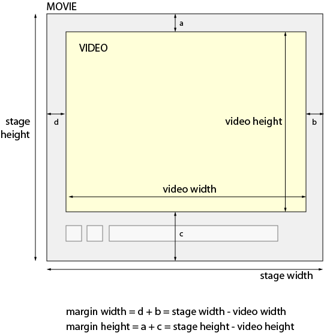

# Ajustes de aplicación{#application-setup}

Puede utilizar las páginas de configuración de la aplicación para introducir ajustes generales, crear ajustes preestablecidos de imagen, ajustes preestablecidos de codificación de vídeo, ajustes preestablecidos de visualizador o definir visores y metadatos predeterminados. Puede configurar ajustes preestablecidos de conjuntos por lotes para automatizar también la generación de conjuntos de giros 2D (por ejemplo), la configuración de publicación y la configuración de SEO de vídeo.

>[!NOTE]
>
>Solo los administradores de Adobe Dynamic Media Classic pueden cambiar la configuración en Configuración de la aplicación.

## Configuración general {#general-settings}

Para abrir la página Configuración general de la aplicación, en la barra de navegación global, vaya a **[!UICONTROL Configurar]** > **[!UICONTROL Ajustes de aplicación]** > **[!UICONTROL Configuración general]**.

### Servidores

Al crear la cuenta, Adobe Dynamic Media Classic proporciona automáticamente los servidores asignados a su empresa. Estos servidores se utilizan para crear cadenas URL para su página web y sus aplicaciones. Estas llamadas mediante URL son específicas para su cuenta.

Consulte también [Prueba del servicio Secure Testing](testing-assets-making-them-public.md#testing_the_secure_testing_service).

* **[!UICONTROL Servidor de publicación]** : Este servidor es el servidor CDN (red de distribución de contenido) activo que se utiliza en todas las llamadas URL generadas por el sistema específicas a su cuenta. No cambie este nombre de servidor a menos que un técnico de soporte de Adobe Dynamic Media Classic se lo indique.

* **[!UICONTROL Servidor de origen]** : Este servidor solo se utiliza para pruebas de garantía de calidad. No cambie este nombre de servidor a menos que un técnico de soporte de Adobe Dynamic Media Classic se lo indique.

<!-- **AGM Server Name** This server is used for Web-to-Print templates. This server is set on a company-wide basis. Do not change this server name unless instructed to do so by an Adobe DynamicMedia Classic support technician. -->

* **[!UICONTROL Nombre del servidor de Test&amp;Target]** - Su URL de Test&amp;Target, hasta .com. Para obtener instrucciones sobre cómo obtener esta URL, consulte Integrar [!DNL Adobe Dynamic Media Classic] con [!DNL Adobe Target Standard/Premium].

<!-- **Test Publish Context Server Name** -->

* **[!UICONTROL Nombre del servidor de flujo iOS]** - La dirección URL de su [!DNL Adobe Dynamic Media Classic] Servidor de streaming de iOS. Este servidor ofrece transmisión de vídeo para los dispositivos basados en iOS utilizando el protocolo HTTP.

* **[!UICONTROL Nombre del servidor de vídeo progresivo]** - La dirección URL de su [!DNL Adobe Dynamic Media Classic] servidor de vídeo progresivo. Este servidor ofrece vídeo progresivo utilizando el protocolo HTTP.

* **[!UICONTROL Mostrar URL de recursos sin publicar]** - Seleccione esta opción si lo desea [!DNL Adobe Dynamic Media Classic] para mostrar una URL al previsualizar cualquier recurso, independientemente de si se ha publicado o no. Si el recurso no está publicado, la URL no funciona. Sin embargo, puede utilizar la dirección URL para fines de planificación o de organización.

<!-- **Allow AIR install** Select this option to allow users to download Adobe Dynamic Media Classic desktop version to their local hard drives. Users install the application from the Desktop Version area of the Personal Setup screen. -->

<!-- AIR users must manually uninstall their existing app and reinstall from the web version of Adobe Dynamic Media Classic (in Personal Settings). After this one-time reinstallation, you are prompted to upgrade whenever the server has a newer version of Adobe Dynamic Media Classic AIR. Adobe Dynamic Media Classic is integrated with the Application Update Framework which streamlines the upgrade process. -->

* **[!UICONTROL Plantilla de invalidación de CDN]** : especifica la plantilla que se utiliza para invalidar la caché de la red de distribución de contenido (CDN).

  Por ejemplo, supongamos que introduce una URL de imagen (incluidos los ajustes preestablecidos o modificadores de imagen) que haga referencia a `<ID>`, en lugar de un ID de imagen específico, como en el siguiente ejemplo:

  `https://sample.scene7.com/is/image/Company/<ID>?$s7product$`

  Si la plantilla solo contiene `<ID>`, luego Adobe Dynamic Media Classic rellena el `https://<server>/is/image`, donde `<server>` es el nombre del servidor de publicación definido en Configuración general.

  Al establecer la plantilla de invalidación de CDN, seleccione una imagen denominada Backpack_B y, a continuación, vaya a **[!UICONTROL Archivo]** > **[!UICONTROL Invalidar CDN]** Esto da como resultado la siguiente URL generada en la interfaz de invalidación de CDN:

  `https://sample.scene7.com/is/image/Company/Backpack_B?$s7product$`

  En el cuadro de lista Dirección URL, seleccione **[!UICONTROL Continuar]** para borrar la caché de esa llamada URL de imagen específica. También puede agregar direcciones URL escribiéndolas o pegándolas en el cuadro de lista URL; no necesita establecer la plantilla de antemano.

  Después de seleccionar la plantilla de invalidación de CDN y de realizar una solicitud de invalidación de CDN, aparece un indicador en la interfaz de usuario. Proporciona una estimación del tiempo que se tarda en borrar la caché.

  Del mismo modo, si se seleccionan varias imágenes en Adobe Dynamic Media Classic al ir a **[!UICONTROL Archivo]** > **[!UICONTROL Invalidar CDN]**, se hace referencia a cada imagen en la URL de plantilla guardada. Por lo tanto, puede definir una plantilla de invalidación de CDN que haga referencia a cada URL a la que se hace referencia en el sitio web (como detalles del producto y resultados de búsqueda). A continuación, cuando se seleccione una o varias imágenes para la invalidación desde la caché, las direcciones URL rellenan automáticamente la interfaz.

  Consulte [Caché de contenido](dmc-platform-overview.md#content_caching).

  Consulte [Segunda publicación de recursos y retrasos de CDN](publishing-files.md#republished_assets_and_cdn_delays).

### Examinar

* **[!UICONTROL Mostrar proyectos]** : Determina si los proyectos están disponibles como medio para organizar los recursos de Adobe Dynamic Media Classic. Consulte [Organizar el trabajo con proyectos](/help/using/organizing-projects.md).

* **[!UICONTROL Mostrar contenido de eVideo de muestra]** - Activar o desactivar la visualización del contenido de muestra de eVideo.

* **[!UICONTROL Mostrar contenido generado]** : En las carpetas, muestra el contenido generado a partir de un recurso. Por ejemplo, cuando un archivo de PDF se rasteriza a medida que se carga, Adobe Dynamic Media Classic crea una imagen para cada página en el PDF original. Si la opción Mostrar contenido generado está seleccionada, cada imagen generada durante la carga del PDF original aparecerá junto con el PDF en la carpeta en la que se cargó.

* **[!UICONTROL Mostrar vídeos codificados]** - Deseleccionado (desactivado) de forma predeterminada.

  Para buscar vídeos rápidamente en Adobe Dynamic Media Classic sin tener que navegar por varios derivados codificados del mismo vídeo, deje esta opción sin seleccionar (predeterminada). Solo se muestran la miniatura del vídeo principal (el vídeo de origen que ha cargado y utilizado para crear los derivados) y la miniatura del conjunto de vídeos adaptable &quot;principal&quot; (que contiene los derivados &quot;secundarios&quot; del conjunto de vídeos codificado).

  Sin embargo, aún puede acceder a vídeos codificados individuales desde el vídeo principal o el conjunto de vídeos adaptables. Para ello, haga doble clic en la imagen en miniatura del vídeo para abrir la vista de detalles. A continuación seleccione **[!UICONTROL Vídeos codificados]** en el panel derecho para poder acceder a todos los vídeos &quot;secundarios&quot;.

  También puede ir a **[!UICONTROL Archivo]** > **[!UICONTROL Reprocesar]** para crear vídeos &quot;secundarios&quot; más codificados directamente desde un conjunto de vídeos adaptables. Adobe Dynamic Media Classic encuentra automáticamente el vídeo principal del conjunto de vídeos adaptable y lo utiliza como vídeo de origen para la transcodificación. Sin embargo, cuando se guardan los nuevos vídeos codificados individuales, estos no se ven al buscar o examinar un elemento. No obstante, siguen siendo accesibles desde la ficha Vídeos codificados en la vista de detalles.

  Consulte [Carga y transcodificación de vídeos](uploading-encoding-videos.md#uploading_and_encoding_videos).

  Para mantener la capacidad de tener acceso a todos los derivados del vídeo codificado al buscar y examinar, seleccione **[!UICONTROL Mostrar vídeos codificados]**.

  Hay ciertas acciones en el menú Generar que solo funcionan, o funcionan de forma opcional, con vídeos individuales. Esta funcionalidad hace que sea necesario mostrar todos los derivados de vídeos codificados que pueda seleccionar, independientemente de cómo haya definido la opción **[!UICONTROL Mostrar vídeos codificados]**. Las acciones de compilación que anulan el **[!UICONTROL Mostrar vídeos codificados]** configuración incluir **[!UICONTROL Conjuntos de vídeos adaptables]**, y **[!UICONTROL Catálogos electrónicos]**.

  >[!NOTE]
  >
  >Si no ha utilizado Adobe Dynamic Media Classic para cargar y codificar los recursos de vídeo, Adobe Dynamic Media Classic muestra todos los vídeos codificados individualmente, aunque esta opción no esté seleccionada.

* **[!UICONTROL Mostrar botón Actualizar subcarpetas]** - Activar o desactivar la visualización del botón Actualizar subcarpetas.

### Cuenta de FTP de Adobe Dynamic Media Classic

* **[!UICONTROL Servidor]** - Muestra el servidor de cuentas de FTP.

* **[!UICONTROL Nombre de usuario]** - Indica el nombre de usuario de la cuenta de FTP.

### Cargar a la aplicación

Consulte también [Opciones de trabajo de carga predeterminadas](https://s7d5.scene7.com/s7viewers/html5/VideoViewer.html?videoserverurl=https://s7d5.scene7.com/is/content/&amp;emailurl=https://s7d5.scene7.com/s7/emailFriend&amp;serverUrl=https://s7d5.scene7.com/is/image/&amp;config=Scene7SharedAssets/Universal_HTML5_Video&amp;contenturl=https://s7d5.scene7.com/skins/&amp;asset=S7tutorials/569_Default%20Job%20Options_converted%20renamed_Getting%20Started-AVS) vídeo de formación.

* **[!UICONTROL Sobrescribir imágenes]** : Adobe Dynamic Media Classic no permite que dos archivos tengan el mismo nombre. El Adobe Dynamic Media Classic ID de cada elemento (el nombre de imagen menos la extensión del nombre de archivo) debe ser único. Debido a esta regla, el cuadro de diálogo Cargar dispone de una opción Sobrescribir. El efecto exacto de esta opción depende de la opción Sobrescribir imágenes especificada. Estas opciones especifican cómo se cargan las imágenes de sustitución: si sustituyen las imágenes originales o si se convierten en imágenes duplicadas. Las imágenes duplicadas cambian de nombre con &quot;-1&quot; (por ejemplo, chair.tif cambia de nombre chair-1.tif). Estas opciones también afectan a las imágenes cargadas en una carpeta distinta de la original o a las imágenes con una extensión de nombre de archivo diferente de la original (como JPG, TIF o PNG). Consulte [Utilizar la opción Sobrescribir imágenes](#using-the-overwrite-images-option).

   * **[!UICONTROL Sobrescribir en la carpeta actual, mismo nombre/extensión de la imagen base]** : Esta opción es la regla más estricta para el reemplazo. Exige que la imagen de sustitución se cargue en la misma carpeta y tenga la misma extensión de nombre de archivo que la imagen original. Si no se cumplen estos requisitos, se crea un duplicado.

   * **[!UICONTROL Sobrescribir en la carpeta actual con mismo nombre de recurso base independientemente de la extensión]** : Requiere que cargue la imagen de reemplazo en la misma carpeta que el original, aunque la extensión del nombre del archivo puede ser diferente del original. Por ejemplo, silla.tif sustituye silla.jpg.

   * **[!UICONTROL Sobrescribir en cualquier carpeta con mismo nombre/extensión de recurso base]** : Requiere que la imagen de reemplazo tenga la misma extensión de nombre de archivo que la imagen original (por ejemplo, chair.jpg debe reemplazar chair.jpg, no chair.tif). Sin embargo, puede cargar la imagen de sustitución en otra carpeta distinta de la original. La imagen actualizada reside en la nueva carpeta; el archivo ya no se encuentra en su ubicación original.

   * **[!UICONTROL Sobrescribir en cualquier carpeta con mismo nombre de recurso base independientemente de la extensión]** : Esta opción es la regla de reemplazo más inclusiva. Puede cargar la imagen de sustitución en otra carpeta distinta de la original, cargar un archivo con una extensión de nombre de archivo diferente y sustituir el archivo original. Si el archivo original está en otra carpeta, la imagen de sustitución residirá en la nueva carpeta en la que se haya cargado.

* **[!UICONTROL Conservar publicación]** : Especifica si una imagen de reemplazo cargada en Adobe Dynamic Media Classic conserva la configuración Listo para publicar de la imagen que está reemplazando o si la configuración se especifica en la carga.

* **[!UICONTROL Perfiles de color predeterminados]** - Especifica los perfiles de color aplicados como parte de las opciones de perfil de color predeterminadas al añadir imágenes CMYK.

* **[!UICONTROL Opciones de carga predeterminadas]** : abre el cuadro de diálogo Opciones de carga de trabajo, donde puede especificar las opciones de carga predeterminadas. Para obtener información sobre estas opciones, consulte [Opciones de carga](/help/using/uploading-files.md#upload_options).

### Editor de mapas de imagen (a aplicación)

* **[!UICONTROL HREF de mapeado de imágenes predeterminado]** : define la dirección URL predeterminada que se utiliza para la columna HREF en la asignación de imágenes. Esta URL es la URL predeterminada que se ve al crear mapas de imágenes.

* **[!UICONTROL Plantilla de asignación de imagen predeterminada]** : define el JavaScript predeterminado para la plantilla HREF en la asignación de imágenes. Puede configurar el código personalizado aquí para que se ejecute cada vez que seleccione un mapa de imagen.

### Otra configuración (para la aplicación)

* **[!UICONTROL Las Advertencias De La Papelera Pueden Limpiar]** - Los recursos de la papelera se eliminan automáticamente en un plazo de siete días. Seleccione &quot;Enviar correos electrónicos antes de que los elementos de la papelera se eliminen automáticamente&quot; si desea que se envíen notificaciones a los administradores de la empresa cuando falten cuatro días para que los recursos de la papelera se eliminen de forma permanente. Consulte [Administrar la carpeta Papelera](/help/using/trash-folder.md).

## Utilizar la opción Sobrescribir imágenes {#using-the-overwrite-images-option}

Adobe Dynamic Media Classic no permite que dos archivos tengan el mismo nombre. El Adobe Dynamic Media Classic ID de cada elemento (el nombre de imagen menos la extensión del nombre de archivo) debe ser único. Debido a esta regla, el cuadro de diálogo Cargar incluye las opciones Sobrescribir imágenes. El efecto exacto de esta opción depende de una configuración para la configuración interna de Adobe Dynamic Media Classic de cada empresa.

Si anteriormente cargó imágenes y después cambió los archivos originales (o los reemplazó), la opción Sobrescribir seleccionada especifica cómo Adobe Dynamic Media Classic reemplaza las imágenes. No se modifica ningún dato referente a la imagen sino que la nueva imagen sustituye la antigua. Si la carpeta también contiene imágenes que aún no están en Adobe Dynamic Media Classic, se añadirán estas imágenes.

Utilice esta opción si las imágenes que ha cargado han cambiado de alguna manera (la imagen se ha alterado) pero la referencia a la imagen sigue siendo la misma. Sobrescribir también resulta útil al cargar y copiar PDF de Adobe®. Para ajustar el modo en que Adobe Dynamic Media Classic *rasgaduras* Para la imagen, ajuste las opciones de perfil de color ICC en el cuadro de diálogo Cargar y vuelva a cargar utilizando la función Sobrescribir.

Los Adobe Dynamic Media Classic ID que se utilizan para acceder a las imágenes de los servidores de producción se derivan de los nombres de archivo de imagen. El uso de caracteres en mayúsculas y minúsculas en el nombre del archivo es importante, tanto para reemplazar los archivos existentes como para los Adobe Dynamic Media Classic ID utilizados para acceder a la imagen. Asegúrese de que el uso de caracteres en mayúsculas y minúsculas en los nombres de archivo es correcto antes de cargarlos en Adobe Dynamic Media Classic para evitar ID de Adobe Dynamic Media Classic que solo difieren en el caso de la misma imagen.

Al anular la selección de esta opción, todas las imágenes que tengan los mismos nombres de archivo como imágenes existentes se tratan como duplicados y, por consiguiente, no se agregan.

## Ajustes preestablecidos de imagen {#image-presets}

En la pantalla Ajustes preestablecidos de imagen se pueden crear y editar ajustes preestablecidos de imagen. Los ajustes preestablecidos de imagen permiten a Adobe Dynamic Media Classic ofrecer imágenes dinámicamente en diferentes tamaños desde la misma imagen principal. Cada ajuste preestablecido de imagen representa una serie de comandos predefinidos de formato y tamaño que determinan la presentación de las imágenes. Al crear un ajuste preestablecido de imagen, selecciona un tamaño para la entrega de imágenes. También se seleccionan comandos de formato para optimizar el aspecto de la imagen cuando se entrega la imagen para su visualización.

Los administradores pueden crear ajustes preestablecidos para exportar recursos. Los usuarios pueden elegir un ajuste preestablecido al exportar imágenes, que también redistribuye las imágenes según las especificaciones del administrador.

Para abrir la pantalla Ajuste preestablecido de imagen, en la barra de navegación global, vaya a **[!UICONTROL Configurar]** > **[!UICONTROL Ajustes preestablecidos de imagen]**.

Consulte [Imágenes inteligentes](https://experienceleague.adobe.com/docs/experience-manager-65/assets/dynamic/imaging-faq.html).

### Creación y edición de ajustes preestablecidos de imagen {#creating-and-editing-image-presets}

1. Ir a **[!UICONTROL Configurar]** > **[!UICONTROL Ajustes preestablecidos de imagen]**.
1. Cree un ajuste preestablecido o comience desde uno existente:

   * **Crear un ajuste preestablecido de imagen** - Seleccionar **[!UICONTROL Añadir]**.
   * **Crear un ajuste preestablecido de imagen a partir de un ajuste preestablecido existente** : seleccione el ajuste preestablecido de imagen que se parezca más al que desea crear y, a continuación, seleccione **[!UICONTROL Editar]**.

1. En la página Agregar (o editar) ajuste preestablecido, introduzca un nombre para el ajuste preestablecido.
1. Defina las opciones de ajustes preestablecidos que desea. 

   Consulte [Opciones de ajuste preestablecido de imagen](application-setup.md#image_preset_options).

1. Seleccionar **[!UICONTROL Guardar]**, o si ha empezado desde un ajuste preestablecido existente, seleccione **[!UICONTROL Guardar como]**.
1. Para previsualizar el ajuste preestablecido con su propia imagen, seleccione **[!UICONTROL Examinar]** y luego seleccione una imagen. Para obtener una vista previa con la imagen predeterminada, seleccione **[!UICONTROL Restablecer]**.

Para editar un ajuste preestablecido de imagen, seleccione su nombre en la pantalla Ajustes preestablecidos de imagen y, a continuación, seleccione **[!UICONTROL Editar]**. Para eliminar un ajuste preestablecido de imagen, selecciónelo y, a continuación, seleccione **[!UICONTROL Eliminar]**.

### Opciones de ajuste preestablecido de imagen {#image-preset-options}

En las pantallas de adición y edición de ajustes preestablecidos, encontrará las siguientes opciones de creación y edición de ajustes preestablecidos de imagen:

* **[!UICONTROL Nombre de ajuste preestablecido]** : introduzca un nombre descriptivo sin espacios en blanco. Para ayudar a los usuarios a identificar este ajuste preestablecido de imagen, incluya la especificación de tamaño de imagen en el nombre.

* **[!UICONTROL Anchura y altura]** : introduzca el tamaño en píxeles de la imagen resultante.

* **[!UICONTROL Formato]** - Seleccione un formato en el menú. Al elegir el formato de GIF, JPEG, PDF o TIFF, aparecerán más opciones:

   * Opciones de Cuantificación de color GIF

      * **[!UICONTROL Tipo]** : seleccione Adaptable (opción predeterminada), Web o Mac. Si selecciona **[!UICONTROL GIF con Alpha]**, la opción Mac no está disponible.

      * **[!UICONTROL Tramado]** - Seleccione Difuso o Desactivado.

      * **[!UICONTROL Número de colores]** - Arrastre el control deslizante para introducir 2-255.

      * **[!UICONTROL Lista de colores]** : introduzca una lista separada por comas. Por ejemplo, para blanco, gris y negro, escriba `000000,888888,ffffff`.

   * Opciones JPEG

      * **[!UICONTROL Calidad]** - Controla el nivel de compresión del JPEG. Esta configuración afecta tanto al tamaño como a la calidad de la imagen. La escala de la calidad JPEG va de 1 a 100.

      * **[!UICONTROL Activar disminución de resolución de crominancia de JPG]** - Dado que el ojo es menos sensible a la información de color de alta frecuencia que la luminancia de alta frecuencia, las imágenes JPEG dividen la información de la imagen en componentes de luminancia y color. Al comprimir una imagen JPEG, el componente de luminancia conserva la totalidad de su resolución, mientras que la resolución de los componentes de color se disminuye mediante promedios de grupos de píxeles. La disminución de la resolución reduce el volumen de datos en la mitad o en un tercio, y casi no afecta a la calidad percibida. La disminución de resolución no se aplica a las imágenes en escala de grises. Esta técnica reduce la cantidad de compresión, lo cual resulta útil para las imágenes de mayor contraste (por ejemplo, las imágenes con texto superpuesto).

   * Opciones PDF y TIFF

      * **[!UICONTROL Compresión]** - Seleccione un algoritmo de compresión.

* **[!UICONTROL Colorspace]** - Seleccione un espacio de color.

* **[!UICONTROL Enfoque]** - Seleccione la opción Activar enfoque simple para aplicar un filtro de enfoque básico a la imagen después de que se produzca todo el escalado. El enfoque puede ayudar a ver mejor las imágenes borrosas que se obtienen al mostrar una imagen en un tamaño diferente. 

  Para obtener más información sobre el enfoque, los modos de remuestreo y el enmascaramiento de enfoque, consulte [Enfoque de una imagen](sharpening-image.md#sharpening_an_image). Consulte también [Enfoque](https://s7d5.scene7.com/s7viewers/html5/VideoViewer.html?videoserverurl=https://s7d5.scene7.com/is/content/&amp;emailurl=https://s7d5.scene7.com/s7/emailFriend&amp;serverUrl=https://s7d5.scene7.com/is/image/&amp;config=Scene7SharedAssets/Universal_HTML5_Video&amp;contenturl=https://s7d5.scene7.com/skins/&amp;asset=S7tutorials/547_sharpening1_converted%20renamed_Done-AVS) vídeo de formación.

* **[!UICONTROL Modo de remuestreo]** - Seleccione una opción de modo de remuestreo. Estas opciones pueden enfocar la imagen cuando se disminuye su resolución:

* **[!UICONTROL Lineal B]** : el método de remuestreo más rápido; pueden verse algunos defectos de solapamiento.

* **[!UICONTROL Bicúbico]** : Aumenta el uso de la CPU en el servidor de imágenes, pero genera imágenes más nítidas con artefactos de solapamiento menos evidentes.

* **[!UICONTROL `Sharp 2`]** - Puede producir resultados algo más nítidos que la opción Bicúbico, pero con un coste de CPU aún mayor en el servidor de imágenes.

* **[!UICONTROL Trilineal]** : Utiliza resoluciones más altas y más bajas, si está disponible; recomendado solo cuando el solapamiento es un problema. Este método reduce el tamaño JPEG debido a la reducción de datos de alta frecuencia.

* **[!UICONTROL Máscara de enfoque]** - Elija estas opciones para ajustar el enfoque:

* **[!UICONTROL Cantidad]** - Controla la cantidad de contraste aplicado a los píxeles del borde. El valor predeterminado es 1,0. En las imágenes de alta resolución, puede aumentarse hasta 5,0. La cantidad equivaldría a la medida de la intensidad del filtro.

* **[!UICONTROL Radio]** : Determina el número de píxeles adyacentes a los píxeles de borde que afectan al enfoque. Para las imágenes de alta resolución, introduzca una cantidad de 1 a 2. Un valor bajo aplica enfoque solo a los píxeles de borde; un valor alto aplica enfoque a un mayor número de píxeles. El valor adecuado depende del tamaño de la imagen.

* **[!UICONTROL Umbral]** - Determina el intervalo de contraste que debe omitirse cuando se aplica el filtro de máscara de enfoque. Es decir, esta opción determina en qué deben diferenciarse los píxeles enfocados del área que los rodea antes de ser considerados píxeles de borde y por tanto enfocados. Para evitar la introducción de ruido, experimente con valores entre 0,02 y 0,2. El valor predeterminado (6) aplica enfoque a todos los píxeles de la imagen.

* **[!UICONTROL Espacio de color]** - Determina si la imagen utiliza el espacio en el que se creó, normalmente RGB (Original) o un espacio de luminancia (Intensidad).

* **[!UICONTROL Color]** Elija estas opciones:

* **[!UICONTROL Perfil de color de salida]** - Seleccionar **[!UICONTROL Usar valor predeterminado]** o uno de los perfiles de color ICC disponibles en Adobe Dynamic Media Classic.

  Consulte también [Perfiles ICC](icc-profiles.md#icc_profiles).

* **[!UICONTROL Interpretación]** : seleccione una opción si desea anular la interpretación predeterminada del perfil de color. Utilice esta opción cuando uno de los perfiles ICC predeterminados sea el espacio de color de destino de una conversión de color. O bien, un dispositivo de salida (impresora o monitor) está caracterizado por este perfil y la interpretación especificada es válida para este perfil.

* **[!UICONTROL Incrustar perfil]** - Seleccione esta opción para que, si abre esta imagen en Adobe® Photoshop®, utilice este perfil.

* **[!UICONTROL Resolución de impresión]** - Seleccione una resolución para imprimir esta imagen; la predeterminada es 72 píxeles.

* **[!UICONTROL Modificadores de URL]** : Si prefiere especificar los modificadores de URL que definen el ajuste preestablecido de imagen en lugar de la configuración, introduzca los modificadores aquí.

* **[!UICONTROL URL de imagen de muestra]** : enumera la cadena URL &quot;sin procesar&quot; que utiliza el servidor de imágenes de Dynamic Media para entregar imágenes con el ajuste preestablecido de imagen que está agregando o editando. Esta cadena de URL codifica todos los ajustes de formato que seleccione en la pantalla Añadir ajuste preestablecido o Editar ajuste preestablecido.

### Editar, quitar o desactivar un ajuste preestablecido de imagen {#editing-removing-or-deactivating-an-image-preset}

1. Ir a **[!UICONTROL Configurar]** > **[!UICONTROL Ajustes preestablecidos de imagen]**.
1. En la pantalla Ajustes preestablecidos de imagen, seleccione un ajuste preestablecido de la tabla y, a continuación, realice una de las siguientes acciones:

   * Seleccionar **[!UICONTROL Editar]** y, a continuación, especifique las nuevas opciones en el cuadro de diálogo Editar ajuste preestablecido.
   * Seleccionar **[!UICONTROL Eliminar]** para quitar el ajuste preestablecido de la lista.
   * Anule la selección de **[!UICONTROL Activo]** casilla de verificación situada junto a un nombre de ajuste preestablecido si desea eliminarlo de toda la interfaz de usuario de Adobe Dynamic Media Classic para los usuarios de MediaPortal.

## Activar o desactivar ajustes preestablecidos de vídeo adaptables {#activating-or-deactivating-adaptive-video-presets}

Adobe Dynamic Media Classic ofrece ajustes preestablecidos de codificación de vídeo adaptable. Es una lista principal de ajustes preestablecidos que combina ajustes preestablecidos de vídeo adaptable 16:9 y ajustes preestablecidos de vídeo adaptable 4:3 en un grupo. Estos ajustes preestablecidos predefinidos reflejan la configuración de codificación más común y se han optimizado para la reproducción en dispositivos móviles, tablets y escritorios.

Solo los ajustes preestablecidos de codificación de &quot;Vídeo adaptable&quot; están activados (habilitados o &quot;activados&quot;) de forma predeterminada. Puede desactivarlos, si lo desea. Los ajustes preestablecidos de vídeos adaptables inactivos no aparecen como una opción seleccionable en la sección eVideo del cuadro de diálogo Opciones de trabajo de carga.

Consulte [Carga y codificación de vídeos](uploading-encoding-videos.md#uploading_and_encoding_videos).

Consulte también [Ajustes preestablecidos de vídeo](https://s7d5.scene7.com/s7viewers/html5/VideoViewer.html?videoserverurl=https://s7d5.scene7.com/is/content/&amp;emailurl=https://s7d5.scene7.com/s7/emailFriend&amp;serverUrl=https://s7d5.scene7.com/is/image/&amp;config=Scene7SharedAssets/Universal_HTML5_Video&amp;contenturl=https://s7d5.scene7.com/skins/&amp;asset=S7tutorials/549_video-presets_converted%20renamed_Done-AVS) vídeo de formación.

**Para activar o desactivar ajustes preestablecidos de vídeo adaptables:**

1. Cerca de la esquina superior derecha de Adobe Dynamic Media Classic, vaya a **[!UICONTROL Configurar]** > **[!UICONTROL Ajustes de aplicación]** > **[!UICONTROL Ajustes preestablecidos de vídeo]** > **[!UICONTROL Ajustes preestablecidos de vídeo adaptable]**.
1. En la página Ajustes preestablecidos de vídeo, anule la selección de la casilla de verificación situada junto al nombre de un ajuste preestablecido para quitarlo de la lista Opciones de eVideo del cuadro de diálogo Opciones de trabajo de carga.
1. Seleccionar **[!UICONTROL Cerrar]**.

## Ajustes preestablecidos de vídeo para la codificación de archivos de vídeo {#video-presets-for-encoding-video-files}

Para seleccionar un ajuste preestablecido de codificación, en la esquina inferior derecha de la página Cargar, seleccione **[!UICONTROL Opciones de trabajo]**. En el cuadro de diálogo Cargar opciones del trabajo, expanda Opciones de eVideo y seleccione los ajustes preestablecidos de codificación de vídeo que desee.

>[!NOTE]
>
>Excepto &quot;Vídeo adaptable&quot;, que está activado de forma predeterminada, no puede ver todos los demás ajustes preestablecidos de codificación de vídeo adaptable o de vídeo único en el cuadro de diálogo Opciones de carga de trabajo. Los administradores de Adobe Dynamic Media Classic determinan qué ajustes preestablecidos de codificación de vídeo están visibles en el cuadro de diálogo Opciones de carga de trabajo.

* Seleccione entre los siguientes ajustes preestablecidos de codificación de vídeo adaptable o de codificación única:

   * **[!UICONTROL Vídeo adaptable 16:9]** : Cree vídeos con una relación de aspecto de 16:9 para enviarlos a equipos de escritorio, dispositivos móviles (iPhone, iPad, Android™) y tabletas (iPad, Android™), optimizados con la resolución y la velocidad de bits que mejor se adapten a la velocidad de conexión del visualizador.

   * **[!UICONTROL Vídeo adaptable 4:3]** : Cree vídeos de relación de aspecto 4:3 para su entrega a equipos de escritorio, dispositivos móviles (iPhone, iPad, Android™) y tabletas (iPad, Android™), optimizados con la resolución y la velocidad de bits que mejor se adapten a la velocidad de conexión del visualizador.

   * **[!UICONTROL Vídeo adaptable]** - Un ajuste preestablecido de codificación única que funciona con cualquier relación de aspecto para crear vídeos para su envío a dispositivos móviles, tabletas y de escritorio. Los vídeos originales cargados que se hayan codificado con este ajuste preestablecido se definirán con una altura fija. Sin embargo, la anchura se amplía automáticamente para conservar la relación de aspecto del vídeo.

     Esta flexibilidad de tener una &quot;Escala automática&quot; también está disponible de forma predeterminada al crear su propio ajuste preestablecido de codificación de vídeo personalizado.

     Consulte [Añadir o editar un ajuste preestablecido de codificación de vídeo](uploading-encoding-videos.md#adding_or_editing_a_video_encoding_preset).

   * **[!UICONTROL Codificación de vídeo adaptable (16:9 o 4:3)]** : Cree vídeos con una relación de aspecto de 16:9 y 4:3 para enviarlos a equipos de escritorio, dispositivos móviles (iPhone, iPad, Android™) y tabletas (iPad, Android™). Todo optimizado con la resolución y velocidad de bits que mejor se adapta a la velocidad de conexión del visor.

     Consulte [Ajustes preestablecidos de vídeo de codificación de vídeo adaptable (16:9 o 4:3)](application-setup.md#adaptive_video_encoding_16_9_or_4_3_video_presets)

   * **[!UICONTROL Ajustes preestablecidos de codificación única]**

     >[!NOTE]
     >
     >Para enviar vídeo a los iPads, puede seleccionar un ajuste preestablecido de codificación móvil o Tablet. Los ajustes preestablecidos Tablet están diseñados específicamente para iPad, normalmente con mayor resolución y calidad para aprovechar el tamaño de pantalla más grande y la conexión de ancho de banda más alta. La publicación de archivos de vídeo codificados con un ajuste preestablecido Tablet requiere la inclusión de código de detección de dispositivo en la aplicación o sitio móvil. Este código cambia entre la visualización de vídeo en iPhone o iPad, según el dispositivo de reproducción. Si se selecciona un ajuste preestablecido Móvil para la publicación de archivos de vídeo en iPad, el flujo de trabajo es más simple. El motivo es que puede utilizar el mismo archivo de vídeo para iPhone e iPad. Sin embargo, la calidad se estandariza a la visualización de iPhone de menor resolución.

      * En el grupo Ajustes preestablecidos de codificación, en la lista desplegable Ordenar ajustes preestablecidos de codificación, seleccione Nombre o Tamaño para ordenar los ajustes preestablecidos por nombre o tamaño de resolución.
      * Seleccione un ajuste preestablecido de codificación basado en el tamaño de resolución y el ancho de banda con el que planea reproducir el vídeo.
      * Puede seleccionar Codificación de vídeo adaptable y uno o más ajustes preestablecidos de codificación por vídeo. Por ejemplo, puede codificar un archivo para escritorio o dispositivo móvil en un trabajo de carga.

Después de seleccionar **[!UICONTROL Iniciar carga]**, se cargará el archivo de vídeo principal original y los archivos codificados se generarán a partir del archivo principal.

### Acerca de las opciones de ajustes preestablecidos de codificación {#about-encoding-preset-options}

Los parámetros de las opciones de ajustes preestablecidos de codificación son los siguientes:

* **[!UICONTROL Velocidad de conexión de destino]** - La velocidad de conexión a Internet del usuario final de destino.

* **[!UICONTROL Sufijo de archivo codificado]** : Sufijo que se adjunta al archivo de vídeo codificado para fines de identificación.

* **[!UICONTROL Velocidad de bits de vídeo (velocidad de datos)]** : Cantidad de datos codificados para formar un solo segundo de reproducción de vídeo (en kilobits por segundo).

* **[!UICONTROL Anchura y altura de píxeles]** : la dimensión de anchura de la imagen de pantalla, en píxeles; la dimensión de altura de la imagen de pantalla (en píxeles).

* **[!UICONTROL Fotograma por segundo (fps)]** - El número de fotogramas, o imágenes fijas, para cada segundo de vídeo. En Estados Unidos y Japón, la mayoría de los vídeos se graban a 29,97 fps; en Europa y Asia (excluido Japón), la mayoría se graba a 25 fps. Las películas se graban a 24 fps.

* **[!UICONTROL Velocidad de bits de audio]** : Cantidad de datos codificados para formar un solo segundo de reproducción de audio, en kilobits por segundo.

En las siguientes tablas se muestran las mejores prácticas recomendadas para seleccionar ajustes preestablecidos de vídeo y las convenciones de designación que se utilizan para dar nombre a los archivos codificados.

### Vídeo adaptable (predeterminado) {#adaptive-video-default}

Un ajuste preestablecido de codificación que funciona con cualquier proporción de aspecto para crear vídeos para su distribución en teléfonos móviles, tablets y equipos de escritorio. Los vídeos de origen cargados que se codifican con este ajuste preestablecido (el predeterminado y una práctica recomendada) se establecen en una altura fija, mientras que la anchura se escala automáticamente para conservar la proporción de aspecto del vídeo.

**Vídeo adaptable (predeterminado)**

|  | Nombre de ajuste preestablecido de codificación/Texto de información sobre herramientas | Sufijo de archivo codificado | Velocidad de datos de vídeo (kbps) | Anchura/Altura (píxeles) | Fps | Velocidad de bits de audio (kbps) | Recomendaciones |
|--- |--- |--- |--- |--- |--- |--- |--- |
| 1 | × automática 360, 800 Kbps | _Mobile_Auto×360p_800K | 800 | Auto×360 | Igual que el origen | 64 | Para dispositivos móviles (iPhone, iPad, Android™) |
| 2 | × automático 480, 1400 Kbps | _Tablet_Auto×480p_1400K | 1400 | Automático×480 | Igual que el origen | 96 | Para tablets (iPad, Android™) |
| 3 | × automática 720, 2.600 Kbps | _Escritorio_automático×720p_2600K | 2600 | Auto×720 | Igual que el origen | 128 | Para escritorio |

### Ajustes preestablecidos de vídeo de codificación de vídeo adaptable (16:9 o 4:3) {#adaptive-video-encoding-or-video-presets}

Estos ajustes preestablecidos de codificación de vídeo adaptable combinan una serie de ajustes preestablecidos de codificación individuales que se seleccionan automáticamente en función de la proporción de vídeo que cargue. Por ejemplo, si carga un vídeo 4:3, se codifica automáticamente utilizando los cinco ajustes preestablecidos 4:3 que se encuentran en la lista de ajustes preestablecidos principales en la **Codificación de vídeo adaptable (16:9 o 4:3)** opción.

Para obtener más información sobre los parámetros de las opciones de codificación, consulte [Acerca de las opciones de ajustes preestablecidos de codificación](application-setup.md#about_encoding_preset_options).

**Ajustes preestablecidos de codificación de vídeo adaptable (16:9 o 4:3)**

|  | Nombre de ajuste preestablecido de codificación/Texto de información sobre herramientas | Velocidad de conexión de destino (kbps) | Sufijo de archivo codificado | Velocidad de datos de vídeo (kbps) | Anchura/Altura (píxeles) | Fps | Velocidad de bits de audio (kbps) | Recomendaciones |
|--- |--- |--- |--- |--- |--- |--- |--- |--- |
| 1 | `16:9, 512x288, Mobile (iPhone, iPad, Android&trade;), (400 Kbps)` | 500 | _Mobile_512x288_400K | 400 | 512 x 288 | Igual que el origen | 64 | Baja resolución, 3G |
| 2 | `4:3, 384x288px, Mobile (iPhone, iPad, Android&trade;), (400 Kbps)` | 500 | _Mobile_384x288_400K | 400 | 384 x 288 | Igual que el origen | 64 | Baja resolución, 3G |
| 3 | `16:9, 512x288, Mobile (iPhone, iPad, Android&trade;), (600 Kbps)` | 700 | _Mobile_512x288_600K | 600 | 512 x 288 | Igual que el origen | 64 | Resolución media, 3G |
| 4 | `4:3, 384x288, Mobile (iPhone, iPad, Android&trade;), (600 Kbps)` | 700 | _Mobile_384x288_600 | 600 | 384 x 288 | Igual que el origen | 64 | Resolución media, 3G |
| 5 | `16:9, 640x360, Tablet (iPad, Android&trade;), (800 Kbps)` | 900 | _iPad_640x360_800K | 800 | 640 x 360 | Igual que el origen | 80 | Resolución media, Wi-Fi |
| 6 | `4:3, 640x480, Tablet (iPad, Android&trade;), (800 Kbps)` | 900 | _iPad_640x480_800K | 800 | 640 x 480 | Igual que el origen | 80 | Resolución media, Wi-Fi |
| 7 | `16:9, 768x432, Tablet (iPad, Android&trade;), (1200 Kbps)` | 1,5 Mbps | _iPad_768x432_1200K | 1200 | 768 x 432 | Igual que el origen | 96 | Alta resolución, Wi-Fi |
| 8 | `4:3, 768x576, Tablet (iPad, Android&trade;), (1200 Kbps)` | 1,5 Mbps | _iPad_768x576_1200K | 1200 | 768 x 576 | Igual que el origen | 96 | Alta resolución, Wi-Fi |
| 9 | `16:9, 1280x720, Desktop, (2000 Kbps)` | 3,0 Mbps | _1280x720_2000K | 2000 | 1280 x 720 | Igual que el origen | 128 | Pantalla ancha de alta definición |
| 10 | `4:3, 1280x960, Desktop, (2000 Kbps)` | 3,0 Mbps | _1280x960_2000K | 2000 Kbps | 1280 x 960 | Igual que el origen | 128 | Alta definición |

### Ajustes preestablecidos de codificación de vídeo para equipos de escritorio {#desktop-video-encoding-presets}

Ajustes preestablecidos de codificación de vídeo para MP4 y OGV en ordenadores de escritorio.

Para obtener más información sobre los parámetros de las opciones de codificación, consulte [Acerca de las opciones de ajustes preestablecidos de codificación](application-setup.md#about_encoding_preset_options).

**H264 Main 3.2 - Extensión de archivo Audio AAC, MP4**

|  | Nombre de ajuste preestablecido de codificación/Texto de información sobre herramientas | Velocidad de conexión de destino (kbps) | Sufijo de archivo codificado | Velocidad de datos de vídeo (kbps) | Anchura/Altura (píxeles) | Fps | Velocidad de bits de audio (kbps) | Recomendaciones |
|--- |--- |--- |--- |--- |--- |--- |--- |--- |
| 1 | 16:9, 480x270 (400 Kbps) | 500 | _480x270_400K | 400 | 480x270 | Igual que el origen | 64 | Pantalla ancha de baja resolución |
| 2 | 16:9, 640x360 (800 Kbps) | 900 | _640x360_800K | 800 | 640 x 360 | Igual que el origen | 80 | Resolución media para pantalla ancha |
| 3 | 16:9, 800x450 (1200 Kbps) | 1,5 Mbps | _800x450_1200K | 1200 | 800x450 | Igual que el origen | 96 | Resolución media/alta |
| 4 | 16:9, 1280x720 (2000 Kbps) | 3,0 Mbps | _1280x720_2000K | 2000 | 1280 x 720 | Igual que el origen | 128 | Pantalla ancha de alta definición |
| 5 | 4:3, 320x240 (400 Kbps) | 500 | _320X240_400K | 400 | 320 x 240 | Igual que el origen | 64 | Baja resolución |
| 6 | 4:3, 480x360 (800 Kbps) | 900 | _480x360_800K | 800 | 480x360 | Igual que el origen | 80 | Resolución media |
| 7 | 4:3, 640x480 (1200 Kbps) | 1,5 Mbps | _640x480_1200K | 1200 | 640 x 480 | Igual que el origen | 96 | Resolución media/alta |
| 8 | 4:3, 1280x960 (2000 Kbps) | 3,0 Mbps | _1280x960_2000K | 2000 | 1280 x 960 | Igual que el origen | 128 | Alta definición |

**OGG Theora Vorbis - Extensión de archivo OGV**

|  | Nombre de ajuste preestablecido de codificación/Texto de información sobre herramientas | Velocidad de conexión de destino (kbps) | Sufijo de archivo codificado | Velocidad de datos de vídeo (kbps) | Anchura/Altura (píxeles) | Fps | Velocidad de bits de audio (kbps) | Recomendaciones |
|--- |--- |--- |--- |--- |--- |--- |--- |--- |
| 1 | 16:9, 480x270 (400 Kbps), OGG | 500 | _OGG_480x270_400K | 400 | 480x270 | Igual que el origen | 64 | Pantalla ancha de baja resolución |
| 2 | 16:9, 640 x 360 (800 Kbps), OGG | 900 | _OGG_640x360_800K | 800 | 640 x 360 | Igual que el origen | 80 | Resolución media para pantalla ancha |
| 3 | 16:9, 800x450 (1200 Kbps), OGG | 1,5 Mbps | _OGG_800x450_1200K | 1200 | 800x450 | Igual que el origen | 96 | Resolución media/alta |
| 4 | 16:9, 1.280 x 720 (2.000 Kbps), OGG | 3,0 Mbps | _OGG_1280x720_2000K | 2000 | 1280 x 720 | Igual que el origen | 128 | Pantalla ancha de alta definición |
| 5 | 4:3, 320 x 240 (400 Kbps), OGG | 500 | _OGG_320X240_400K | 400 | 320 x 240 | Igual que el origen | 64 | Baja resolución |
| 6 | 4:3, 480 x 360 (800 Kbps), OGG | 900 | _OGG_480x360_800K | 800 | 480x360 | Igual que el origen | 80 | Resolución media |
| 7 | 4:3, 640 x 480 (1.200 Kbps), OGG | 1,5 Mbps | _OGG_640x480_1200K | 1200 | 640 x 480 | Igual que el origen | 96 | Resolución media/alta |
| 8 | 4:3, 1280x960 (2000 Kbps), OGG | 3,0 Mbps | _OGG_1280x960_2000K | 2000 | 1280 x 960 | Igual que el origen | 128 | Alta definición |

### Ajustes preestablecidos de codificación de vídeo para dispositivos móviles {#mobile-video-encoding-presets}

Igual que fps del origen. Ajustes preestablecidos de codificación de vídeo para dispositivos móviles iPhone, iPad y Android™.

Para obtener más información sobre los parámetros de opciones de codificación, consulte [Acerca de las opciones de ajustes preestablecidos de codificación](application-setup.md#about_encoding_preset_options).

**H264 Baseline 2.1: extensión de archivo MP4 Audio AAC**

|  | Nombre de ajuste preestablecido de codificación/Texto de información sobre herramientas | Velocidad de conexión de destino (kbps) | Sufijo de archivo codificado | Velocidad de bits de vídeo (Kbps) | Anchura y altura en píxeles | Fps | Velocidad de bits de audio (kbps) | Recomendaciones |
|--- |--- |--- |--- |--- |--- |--- |--- |--- |
| 1 | 16:9, 512 x 288 , Móvil (400 kbps) | 500 | _Mobile_512x288_400K | 400 | 512 x 288 | Igual que el origen | 64 | Baja resolución, 3G |
| 2 | 16:9, 512 x 288 , Móvil (600 kbps) | 700 | _Mobile_512x288_600K | 600 | 512 x 288 | Igual que el origen | 64 | Resolución media, 3G |
| 3 | 16:9, 512 x 288 , Móvil (800 kbps) | 900 | _Mobile_512x288_800K | 800 | 512 x 288 | Igual que el origen | 80 | Resolución media, Wi-Fi |
| 4 | 16:9, 512 x 288 , Móvil (1000 kbps) | 1,2 Mbps | _Mobile_512x288_1000K | 1.000 | 512 x 288 | Igual que el origen | 80 | Alta resolución, Wi-Fi |
| 5 | 16:9, 512 x 288 , Móvil (1200 kbps) | 1,5 Mbps | _Mobile_512x288_1200K | 1200 | 512 x 288 | Igual que el origen | 96 | Alta resolución, Wi-Fi |
| 6 | 4:3, 384 x 288 , Móvil (400 kbps) | 500 | _Mobile_384x288_400K | 400 | 384 x 288 | Igual que el origen | 64 | Baja resolución, 3G |
| 7 | 4:3, 384 x 288 , Móvil (600 kbps) | 700 | _Mobile_384x288_600K | 600 | 384 x 288 | Igual que el origen | 64 | Resolución media, 3G |
| 8 | 4:3, 448 x 336 , Móvil (800 kbps) | 900 | _Mobile_448x336_800K | 800 | 448 x 336 | Igual que el origen | 80 | Resolución media, Wi-Fi |
| 9 | 4:3, 448 x 336 , Móvil (1000 kbps) | 1,2 Mbps | _Mobile_448x336_1000K | 1.000 | 448 x 336 | Igual que el origen | 80 | Alta resolución, Wi-Fi |
| 10 | 4:3, 448 x 336 , Móvil (1200 kbps) | 1,5 Mbps | _Mobile_448x336_1200K | 1200 | 448 x 336 | Igual que el origen | 96 | Alta resolución, Wi-Fi |

## Ajustes preestablecidos de visor {#viewer-presets}

>[!NOTE]
>
>**Aviso de fin de vida útil para el visualizador de Flashes** - A partir del 31 de enero de 2017, Adobe Dynamic Media Classic dejará de ofrecer asistencia oficial para la plataforma de visor de Flash.

Un *ajuste preestablecido de visor* es una serie de opciones que determinan la manera en que los usuarios verán los recursos de medios enriquecidos en la pantalla de su ordenador y dispositivos móviles. Como administrador, puede crear ajustes preestablecidos de visor. Se pueden configurar varias opciones de configuración para los visores. Por ejemplo, puede cambiar el tamaño, el comportamiento del zoom, las combinaciones de colores, los bordes y las fuentes del visor.

Se recomienda utilizar los visores de vídeo Adobe Dynamic Media Classic HTML5. Los ajustes preestablecidos utilizados en los visores de vídeo de HTML5 son reproductores de vídeo robustos.

Al combinar en un solo reproductor lo siguiente:

* La capacidad de diseñar los componentes de reproducción mediante HTML5 y CSS.
* Tener reproducción incrustada.
* Utilice flujo continuo adaptable y progresivo según la capacidad del explorador.

Amplía el alcance del contenido multimedia enriquecido a usuarios de equipos de escritorio, tabletas y móviles, y garantiza una experiencia de vídeo optimizada.

Consulte [Acerca de los visores HTML 5](https://experienceleague.adobe.com/docs/dynamic-media-developer-resources/library/viewers-for-aem-assets-only/c-html5-aem-asset-viewers.html?lang=en#viewers-for-aem-assets-only) en la Guía de referencia de visores de Adobe.

Consulte [Matriz de compatibilidad de ajustes preestablecidos de visualizador Adobe Dynamic Media Classic](application-setup.md#scene7_viewer_preset_compatibility_matrix).

Consulte [Práctica recomendada: Uso del visor de vídeo HTML5](best-practice-using-html5-video.md#best_practice_using_the_html5_video_viewer).

Dependiendo del visor, puede añadir funciones de comunidad. Las funciones de la comunidad incluyen los botones de incrustación, enlace y visita al sitio. Estos botones permiten a las personas que utilizan el visor compartir el visor con otras personas o abrir el sitio web de Adobe Dynamic Media Classic.

Consulte también [Ejemplos de la biblioteca de referencia de visores de Adobe](https://landing.adobe.com/en/na/dynamic-media/ctir-2755/live-demos.html).

### Compatibilidad del visor con páginas web diseñadas para responder {#viewer-support-for-responsive-designed-web-pages}

Diferentes páginas Web tienen diferentes necesidades. A veces, desea una página web que proporcione un vínculo que abra el Visor de HTML5 en una ventana independiente del explorador. En otros casos, es necesario incrustar el visualizador de HTML5 directamente en la página de alojamiento. En este último caso, es probable que la página web tenga un diseño estático. O bien, es &quot;adaptable&quot; y se muestra de forma diferente en diferentes dispositivos o para diferentes tamaños de ventana del explorador. Para satisfacer estas necesidades, los visores HTML5 que se incluyen con Adobe Dynamic Media Classic admiten páginas web estáticas y páginas web adaptables.

Para obtener más información sobre cómo incrustar visores adaptables en las páginas web, consulte [Acerca de la biblioteca de imágenes adaptables](https://experienceleague.adobe.com/docs/dynamic-media-developer-resources/image-serving-api/image-serving-api/responsive-static-image-library/c-about-responsive-static-image-library.html#image-serving-api), [Usar biblioteca de imágenes adaptables](https://experienceleague.adobe.com/docs/dynamic-media-developer-resources/image-serving-api/image-serving-api/responsive-static-image-library/t-using-responsive-static-image-library.html#image-serving-api), y [Referencia de comando: atributos de comando](https://experienceleague.adobe.com/docs/dynamic-media-developer-resources/image-serving-api/image-serving-api/responsive-static-image-library/t-using-responsive-static-image-library.html#responsive-static-image-library).

### Tipos de ajustes preestablecidos {#viewer-preset-types}

Los administradores pueden crear y personalizar los siguientes tipos de valores preestablecidos de visor:

* **[!UICONTROL Visor de catálogos electrónicos]** - Simula la experiencia de lectura de un catálogo impreso. Puede desplazarse de página en página, ampliar y reducir elementos de una página, utilizar mapas de imagen para ver más información sobre los elementos de la página o buscar en el catálogo. También puede incluir un panel de información para mostrar información detallada y un elemento de mapa de imagen si el área del mapa tiene un atributo rollover_key válido. Para incluir un panel de información, especifique una dirección URL del servidor de información en la configuración del panel de información de la ventana de ajuste preestablecido de visor de catálogo electrónico.

* **[!UICONTROL Visor de conjuntos de muestras]** - Muestra una imagen en un color, material, textura, acabado o tejido diferente. Los usuarios seleccionan una miniatura para ver las variaciones en la imagen.

* **[!UICONTROL Visor de conjuntos de medios mixtos]** - Muestra diferentes tipos de medios en un visor. Puede incluir conjuntos de muestras, conjuntos de giros, imágenes y vídeos. Puede configurar fichas que contengan distintos tipos de contenido, como una ficha para conjuntos de imágenes y otra ficha para vídeos. Los vídeos que se reproducen desde un conjunto de medios mixtos usan un visor de vídeo estándar con una línea de tiempo y controles de vídeo, como Detener, Pausa, Rebobinar y Reproducir. Al configurar un ajuste preestablecido de visor de conjuntos de medios mixtos, debe especificar qué visores desea usar para los diferentes tipos de recursos en su conjunto de medios mixtos. También puede usar el visor de cuadrícula o carrusel para ver un conjunto de medios mixtos.

* **[!UICONTROL Visor de conjuntos de giros]** : proporciona varias vistas de una imagen para que los usuarios puedan girar el objeto y examinar los diferentes lados y ángulos.

* **Visor de vídeo** - Muestra vídeos utilizando las dimensiones de resolución del archivo de origen o un tamaño personalizado. Adobe Dynamic Media Classic incluye muchos ajustes predefinidos de visualizador para reproducir vídeo y, si es administrador, puede crear ajustes preestablecidos personalizados de visualizador de vídeo. Hay más de 12 ajustes diferentes para configurar el Visor de vídeo. Puede configurar el tamaño, el color de primer plano y fondo, los controles de audio y vídeo, la barra de progreso, la apariencia de la interfaz del usuario, las funciones sociales y la ayuda del visor.

* **[!UICONTROL Visualizadores de zoom]** - Ofrece una opción de tres tipos de visor de zoom:

* **[!UICONTROL Visor de zoom]** : permite a los usuarios ampliar el área seleccionándola. Pueden seleccionar controles para acercar, alejar y restablecer el tamaño predeterminado de la imagen.

* **[!UICONTROL Visor de zoom: Flotante]** - Muestra una segunda imagen del área ampliada junto a la imagen original. No hay controles, los usuarios simplemente mueven la selección sobre la zona que desean ver.

Al determinar el uso del ancho de banda completo para este visor, tenga en cuenta que tanto la imagen principal como la imagen flotante se muestran en el visor. El tamaño de imagen principal (la anchura y altura de escenario) y el factor de zoom determinan el tamaño de la imagen flotante. Para evitar que el tamaño del archivo flotante sea demasiado grande, equilibre estos dos valores: si el tamaño de la imagen principal es muy grande, reduzca el valor de Factor de zoom. (Los valores de Anchura flotante y Altura flotante determinan el tamaño de la ventana flotante, pero no el tamaño de la imagen que se muestra en el visor).

Por ejemplo, si el tamaño de la imagen principal es 350 x 350 píxeles, con un factor de zoom de 3, el tamaño de la imagen flotante que resultará será de 1050 x 1050 píxeles. Si el tamaño de la imagen principal es de 300 x 300 píxeles, con un factor de zoom de 4, el tamaño de la imagen flotante será de 1200 x 1200 píxeles. Según el ajuste de calidad JPEG (el recomendado es entre 80 y 90), podrá reducir el tamaño del archivo en gran medida. Los factores de zoom recomendados son de 2,5 a 4, según el tamaño de la imagen principal.

### Matriz de compatibilidad de ajustes preestablecidos de visualizador Adobe Dynamic Media Classic {#scene-viewer-preset-compatibility-matrix}

**Aviso de fin de vida útil para el visualizador de Flashes**: A partir del 31 de enero de 2017, Adobe Dynamic Media Classic dejará de ofrecer asistencia oficial para la plataforma de visor de Flash.

La siguiente tabla identifica los ajustes preestablecidos de visualizador de Adobe Dynamic Media Classic disponibles actualmente. La tabla también especifica la compatibilidad del visor con dispositivos de escritorio y móviles, así como la tecnología que se utiliza para cada visor determinado.

Consulte también [Ejemplos de la biblioteca de referencia de visores de Adobe](https://landing.adobe.com/en/na/dynamic-media/ctir-2755/live-demos.html).

Para obtener información sobre las versiones de sistema operativo y navegador web admitidas para los visores, consulte las notas de la versión de los visores.

Consulte [Notas de la versión de referencia de visores de Adobe](https://experienceleague.adobe.com/docs/dynamic-media-developer-resources.html).

|  | Tecnología de visor | Ordenador | Apple iPhone | Apple iPad | Smartphone Android™ | Tablet Android™ |
|--- |--- |--- |--- |--- |--- |--- |
| Visores de zoom |  |  |  |  |  |  |
| Universal_HTML5_Flyout | HTML5 | X | X | X | X | X |
| Universal_HTML5_Zoom_inline | HTML5 | X | X | X | X | X |
| Universal_HTML5_Zoom_dark | HTML5 | X | X | X | X | X |
| Universal_HTML5_Zoom_light | HTML5 | X | X | X | X | X |


|  | Tecnología de visor | Ordenador | Apple iPhone | Apple iPad | Smartphone Android™ | Tablet Android™ |
|--- |--- |--- |--- |--- |--- |--- |
| Visores de conjuntos de imágenes |  |  |  |  |  |  |
| Universal_HTML5_Flyout | HTML5 | X | X | X | X | X |
| Universal_HTML5_ImageSet_dark | HTML5 | X | X | X | X | X |
| Universal_HTML5_ImageSet_light | HTML5 | X | X | X | X | X |

|  | Tecnología de visor | Ordenador | Apple iPhone | Apple iPad | Smartphone Android™ | Tablet Android™ |
|--- |--- |--- |--- |--- |--- |--- |
| Visores de conjuntos de muestras |  |  |  |  |  |  |
| Universal_HTML5_Flyout | HTML5 | X | X | X | X | X |
| Universal_HTML5_SwatchSet_dark | HTML5 | X | X | X | X | X |
| Universal_HTML5_SwatchSet_light | HTML5 | X | X | X | X | X |

|  | Tecnología de visor | Ordenador | Apple iPhone | Apple iPad | Smartphone Android™ | Tablet Android™ |
|--- |--- |--- |--- |--- |--- |--- |
| Visualizadores de catálogos electrónicos |  |  |  |  |  |  |
| Universal_HTML 5_eCatalog_Adv(incluye compatibilidad con medios sociales y búsqueda en el catálogo). | HTML5 | X | X | X | X | X |
| Universal_HTML 5_eCatalog(incluye compatibilidad con los medios sociales y la búsqueda en el catálogo). | HTML5 | X | X | X | X | X |

|  | Tecnología de visor | Ordenador | Apple iPhone | Apple iPad | Smartphone Android™ | Tablet Android™ |
|--- |--- |--- |--- |--- |--- |--- |
| Espectadores de giro |  |  |  |  |  |  |
| Universal_HTML5_SpinSet_dark | HTML5 | X | X | X | X | X |
| Universal_HTML5_SpinSet_light | HTML5 | X | X | X | X | X |

**Visores de eVideo**

Adobe Dynamic Media Classic admite la reproducción de vídeo móvil para vídeo MP4 H.264.

* Puede encontrar dispositivos BlackBerry® compatibles con este formato de vídeo en los siguientes enlaces: [Formatos de vídeo compatibles con BlackBerry®](https://developers.blackberry.com/us/en)
* También puede encontrar dispositivos Windows® compatibles con este formato de vídeo en los siguientes enlaces: [Formatos de vídeo compatibles con Windows® Phone](https://learn.microsoft.com/en-us/windows/uwp/audio-video-camera/supported-codecs)

|  | Tecnología de visor | Ordenador | Apple iPhone | Apple iPad | Smartphone Android™ | Tablet Android™ | Smartphone BlackBerry® | Windows® Phone |
|--- |--- |--- |--- |--- |--- |--- |--- |--- |
| Universal_HTML 5_Video(incluye compatibilidad con subtítulos opcionales). Consulte [Práctica recomendada: Uso del visualizador de vídeo Universal HTML5.](best-practice-using-html5-video.md#best_practice_using_the_html5_video_viewer) | HTML5 | X | X | X | X | X | X | X |
| Universal_HTML 5_Video_social(Incluye soporte para subtítulos y medios sociales.) | HTML5 | X | X | X | X | X | X | X |

|  | Tecnología de visor | Ordenador | Apple iPhone | Apple iPad | Smartphone Android™ | Tablet Android™ |
|--- |--- |--- |--- |--- |--- |--- |
| Visores de conjuntos de medios mixtos |  |  |  |  |  |  |
| Universal_HTML5_MixedMedia_dark | HTML5 | X | X | X | X | X |
| Universal_HTML5_MixedMedia_light | HTML5 | X | X | X | X | X |

### Tabla de gestos de visores móviles admitidos {#supported-mobile-viewers-gestures-matrix}

La siguiente tabla identifica los gestos del visor móvil compatibles con los dispositivos iOS, Android™ 2.x y Android™ 3.x.

|  | Tecnología de visor | Ordenador | Apple iPhone | Apple iPad | Smartphone Android™ | Tablet Android™ |
|--- |--- |--- |--- |--- |--- |--- |
| Visores de conjuntos de imágenes |  |  |  |  |  |  |
| Universal_HTML5_Flyout | HTML5 | X | X | X | X | X |
| Universal_HTML5_ImageSet_dark | HTML5 | X | X | X | X | X |
| Universal_HTML5_ImageSet_light | HTML5 | X | X | X | X | X |

### Acerca de la pantalla Ajustes preestablecidos de visor {#about-the-viewer-preset-screen}

Esta pantalla permite crear y gestionar ajustes preestablecidos de visor. Para abrir esta pantalla, vaya a **[!UICONTROL Configurar]** > **[!UICONTROL Ajustes preestablecidos de visor]**.

La pantalla Ajustes preestablecidos de visor ofrece una serie de herramientas para realizar las siguientes tareas:

* **Añadir un ajuste preestablecido** - Seleccionar **[!UICONTROL Añadir]** y realice opciones en el cuadro de diálogo Agregar ajuste preestablecido de visualizador.

      Consulte [Añadir y editar ajustes preestablecidos del visualizador](application-setup.md#adding_and_editing_viewer_presets).
  
* **Editar un ajuste preestablecido** - Seleccione un ajuste preestablecido y, a continuación, seleccione **[!UICONTROL Editar]**.

      Consulte [Añadir y editar ajustes preestablecidos del visualizador](application-setup.md#adding_and_editing_viewer_presets).
  
* **Eliminar un ajuste preestablecido** - Seleccione un ajuste preestablecido y, a continuación, seleccione **[!UICONTROL Eliminar]**.

* **Exportación de un ajuste preestablecido** - Seleccione un ajuste preestablecido de visualizador de HTML5 y, a continuación, seleccione **[!UICONTROL Exportar]** para descargar la apariencia del visualizador y utilizarlo como base para crear y agregar otro ajuste preestablecido de visualizador.

      Consulte [Exportar un ajuste preestablecido de visualizador de HTML5](application-setup.md#export_an_html5_viewer_preset).
  
* **Filtrar la lista de ajustes preestablecidos de visor** - Utilice estas herramientas para filtrar la lista:

      * Abra la lista desplegable **Activo/Inactivo** y seleccione una opción para mostrar los ajustes preestablecidos activos, inactivos o todos los ajustes preestablecidos.
      * Abra la lista desplegable **Visor** y seleccione una opción para ver solo los visualizadores de un tipo determinado. Seleccionar **[!UICONTROL Todos los visores]** ver todos los visualizadores.
  
* **Ordenar ajustes preestablecidos** - Seleccionar un encabezado de columna (**[!UICONTROL Activo]**, **[!UICONTROL Tipo]**, **[!UICONTROL Preestablecido]**, o **[!UICONTROL Plataforma]**) para ordenar la lista en una columna. Seleccione un encabezado de columna por segunda vez para ordenar la lista en orden descendente (o ascendente).

* **Activar y desactivar ajustes preestablecidos** : seleccione un ajuste preestablecido y, a continuación, seleccione su opción Activo para activarlo o desactivarlo.

      Consulte [Activar o desactivar ajustes preestablecidos de visor](application-setup.md#activating_or_deactivating_viewer_presets).
  
>[!NOTE]
>
>Seleccionar **[!UICONTROL Previsualizar]** en la parte derecha de la página Ajustes preestablecidos de visualizador, para que pueda ver el aspecto de un recurso en el Ajuste preestablecido de visualizador que ha seleccionado. Para ver un recurso diferente, seleccione **[!UICONTROL Examinar]** en la página Ajustes preestablecidos de visualizador y seleccione un recurso diferente en el cuadro de diálogo Seleccionar previsualización de recurso.

### Añadir y editar ajustes preestablecidos de visor {#adding-and-editing-viewer-presets}

Además de añadir ajustes preestablecidos de visor mediante **[!UICONTROL Añadir]** en la interfaz de usuario de, también puede utilizar **[!UICONTROL Exportar]** para añadir un ajuste preestablecido de visor. Simplemente exporte un ajuste preestablecido de visualizador de HTML5 existente y, a continuación, utilícelo como base para el nuevo ajuste preestablecido.

Consulte [Exportar un ajuste preestablecido de visualizador de HTML5](application-setup.md#exporting_an_html5_viewer_preset).

Consulte también [Ajustes preestablecidos de visor](https://s7d5.scene7.com/s7viewers/html5/VideoViewer.html?videoserverurl=https://s7d5.scene7.com/is/content/&amp;emailurl=https://s7d5.scene7.com/s7/emailFriend&amp;serverUrl=https://s7d5.scene7.com/is/image/&amp;config=Scene7SharedAssets/Universal_HTML5_Video&amp;contenturl=https://s7d5.scene7.com/skins/&amp;asset=S7tutorials/550_viewer-presets_converted%20renamed_Done-AVS) vídeo de formación.

**Para añadir y editar ajustes preestablecidos de visor:**

1. Cerca de la esquina superior derecha de Adobe Dynamic Media Classic, vaya a **[!UICONTROL Configurar]** > **[!UICONTROL Ajustes preestablecidos de visor]**.

   Puede filtrar la lista de ajustes preestablecidos. Por ejemplo, para ver solo los ajustes preestablecidos para los visores de vídeos, seleccione Visor de vídeos en el menú desplegable de visores que hay en la barra de herramientas, justo encima de la tabla.

1. En la página Ajustes preestablecidos de visualizador, agregue o edite el Ajuste preestablecido de visualizador en la pantalla Ajustes preestablecidos de visualizador.

   * **Añadir** - En la barra de herramientas, seleccione **[!UICONTROL Añadir]**. En el cuadro de diálogo Agregar ajuste preestablecido de visualizador, seleccione una plataforma y un tipo de recurso de medios enriquecidos.

         Seleccionar **[!UICONTROL Guardar como]** cuando haya terminado de crear el ajuste preestablecido del visor.
     
   * **Añadir empezando desde un ajuste preestablecido de visor existente** - En la tabla, seleccione un ajuste preestablecido de visualizador de vídeo y, a continuación, seleccione **[!UICONTROL Editar]** en la barra de herramientas.

         Después de volver a configurar el Visor de vídeo, seleccione **[!UICONTROL Guardar como]** guardar el ajuste preestablecido con un nombre diferente en el campo de texto Nombre del ajuste preestablecido.
     
   * **Editar** - Seleccione un ajuste preestablecido de visor existente y, a continuación, seleccione **[!UICONTROL Editar]**.

1. En la pantalla Configurar visor, en el campo Nombre del ajuste preestablecido, introduzca o edite el nombre del ajuste preestablecido.
1. Defina las opciones restantes que desee.

   >[!NOTE]
   >
   >Seleccionar **[!UICONTROL Igual que el origen]** para cambiar automáticamente el tamaño del Visor de vídeo al tamaño de resolución del propio vídeo codificado. Si selecciona esta opción, no podrá introducir la anchura y la altura del escenario. sino que estas opciones proceden del propio vídeo. Si selecciona **[!UICONTROL Igual que el origen]**, establezca la opción Margin Size para reflejar las dimensiones de la apariencia fuera del área de reproducción del vídeo. Este tamaño de margen es la altura y anchura de píxel de los controles de vídeo. Puede utilizar la siguiente imagen para determinar los tamaños de margen que desea utilizar.*

   

1. Realice una de las siguientes acciones:

   * Seleccionar **[!UICONTROL Guardar como]** si ha añadido un ajuste preestablecido de Visor partiendo de un ajuste preestablecido existente.
   * Seleccionar **[!UICONTROL Guardar]** si ha añadido o editado un ajuste preestablecido de Visor.

### Exportar un ajuste preestablecido de visualizador de HTML5 {#exporting-an-html-viewer-preset}

Puede exportar un ajuste preestablecido de visualizador de HTML5 existente para utilizarlo como base para crear un ajuste preestablecido de visualizador de HTML5. Esta opción de exportación resulta útil porque no tiene que crear el visor de cero, sino que puede exportar un ajuste preestablecido con un aspecto y un comportamiento parecidos a los deseados y, luego, usarlo como punto de partida para realizar ajustes de diseño.

Todos los archivos CSS predeterminados y listos para usar del visualizador en Adobe Dynamic Media Classic utilizan rutas de servicio de imágenes relativas que apuntan a recursos en `Scene7SharedAssets`. Por ejemplo, a continuación se muestra una ruta relativa a un recurso de imagen en un archivo CSS preestablecido de visor en

`Scene7SharedAsset`: `.s7videoviewer .s7fullscreenbutton[state][selected] { background-image: url(/is/image/Scene7SharedAssets/FullScreenButton_dark_sprite?scl=1&fmt=png-alpha); }`

Sin embargo, si aloja archivos CSS de Viewer en su propio sitio, debe resolver estas rutas de imagen relativas mediante una ruta explícita al servidor de imágenes en su propio entorno. Por ejemplo, si actualizó la ruta relativa anterior a una ruta explícita, podría tener el siguiente aspecto, donde `https://s7d1.scene7.com` es la ruta directa al servidor de imágenes: `https://s7d1.scene7.com/is/image/Scene7SharedAssets/FullScreenButton_dark_sprite?scl=1&fmt=png-alpha`

**Para exportar un ajuste preestablecido de visualizador de HTML5:**

```as3
.s7videoviewer .s7fullscreenbutton[state][selected] 
{ background-image: url(/is/image/Scene7SharedAssets/FullScreenButton_dark_sprite?scl=1&fmt=png-alpha); }
```

```as3
https://s7d1.scene7.com/is/image/Scene7SharedAssets/FullScreenButton_dark_sprite?scl=1&fmt=png-alpha
```

1. Ir a **[!UICONTROL Configurar]** > **[!UICONTROL Ajustes preestablecidos de visor]**.
1. En la barra de herramientas Ajustes preestablecidos de visualizador, en la segunda lista desplegable de la izquierda, seleccione **[!UICONTROL HTML 5]**.
1. En la tercera lista desplegable desde la izquierda, seleccione **[!UICONTROL Todos los visores]**.
1. Seleccione el ajuste preestablecido de visualizador que desee utilizar como base para un nuevo ajuste preestablecido de visualizador de HTML5.
1. En la barra de herramientas, seleccione **[!UICONTROL Exportar]**.
1. En el cuadro de diálogo Exportar recursos seleccionados, seleccione **[!UICONTROL Enviar exportación]**.

   Después de la exportación, obtiene un archivo CSS. Descargue y descomprima el archivo.

1. Abra el archivo CSS en un editor de CSS, realice los cambios oportunos y, a continuación, guarde el archivo.
1. Cargue el archivo CSS en Adobe Dynamic Media Classic.

   Consulte [Cargar archivos](uploading-files.md#uploading_files).

1. Publique el archivo CSS en Dynamic Media Image Server.

   Consulte [Publicar archivos](publishing-files.md#publishing_files).

1. Añada el nuevo ajuste preestablecido de visor del modo habitual. Seleccione el archivo CSS de visor que ha cargado.

   Consulte [Agregar y editar ajustes preestablecidos de visor](application-setup.md#adding_and_editing_viewer_presets).

### Activar o desactivar ajustes preestablecidos de visor {#activating-or-deactivating-viewer-presets}

Para crear una URL para mostrar los recursos, los usuarios abren la lista desplegable Ajustes preestablecidos en el cuadro de diálogo Vista previa, seleccionan un Ajuste preestablecido de visor y, a continuación, seleccionan **[!UICONTROL Copiar URL]** (consulte [Copiar la URL de un ajuste preestablecido de visor](application-setup.md#copying_the_url_of_a_viewer_preset)). La lista Ajustes preestablecidos contiene unos ajustes que los administradores pueden agregar y gestionar desde la pantalla Ajustes preestablecidos de visor. Por ejemplo, cuando un usuario obtiene una vista previa de un catálogo electrónico, todos los ajustes preestablecidos de visor del catálogo activo aparecen en la lista desplegable Ajustes preestablecidos, en el cuadro de diálogo Vista previa.

Si no desactiva los ajustes preestablecidos de visor en su pantalla correspondiente, la lista desplegable de ajustes del cuadro de diálogo Ajustes preestablecidos puede llenarse demasiado. 

**Para activar o desactivar los ajustes preestablecidos del visor:**

1. Ir a **[!UICONTROL Configurar]** > **[!UICONTROL Ajustes preestablecidos de visor]**.
1. En la página Ajustes preestablecidos de visor, seleccione o anule la selección **[!UICONTROL Activo]** para activar o desactivar los ajustes preestablecidos del visor.

### Copiar la URL de un ajuste preestablecido de visor {#copying-the-url-of-a-viewer-preset}

Tras publicar un recurso, puede copiar una URL para mostrar el recurso con la configuración de un ajuste preestablecido de visor.

La URL se copiará en el portapapeles. Podrá utilizarla como sea necesario en el código HTML de su página web, dispositivo móvil o aplicación.

**Para copiar la URL de un ajuste preestablecido de visor:**

1. Seleccione el recurso en el panel Examinar.
1. Encima del panel de exploración de recursos, en la parte derecha de la barra de herramientas, realice una de las siguientes acciones:

   * Seleccionar **[!UICONTROL Vista de cuadrícula]**. En el panel de exploración de recursos, haga doble clic en un único recurso para abrirlo en la vista de detalles. En el panel URL e Código incrustado de la derecha, seleccione **[!UICONTROL Copiar URL]** a la derecha del visor que desee.
   * Seleccionar **[!UICONTROL Vista de cuadrícula]**. En el panel Examinar recursos, seleccione un solo recurso y, debajo de la imagen en miniatura, vaya a **[!UICONTROL Previsualizar]** > **[!UICONTROL Lista del visor]**.

   En la página Lista de visualizadores, en la columna Acciones de la tabla, seleccione **[!UICONTROL Copiar URL]**.

   * Seleccionar **[!UICONTROL Vista de lista]**. En el panel Examinar recursos, seleccione un solo recurso y, a continuación, a la derecha de la imagen en miniatura, vaya a **[!UICONTROL Previsualizar]** > **[!UICONTROL Lista del visor]**.

   En la página Lista de visualizadores, en la columna Acciones de la tabla, seleccione **[!UICONTROL Copiar URL]**.

   * Seleccionar **[!UICONTROL Vista de cuadrícula]**, **[!UICONTROL Vista de lista]**, o **[!UICONTROL Vista de detalles]**. En la misma barra de herramientas, vaya a **[!UICONTROL Previsualizar]** > **[!UICONTROL Lista del visor]**.

   En la página Lista de visualizadores, en la columna Acciones de la tabla, seleccione **[!UICONTROL Copiar URL]**.

### Copiar el código de incrustación de un ajuste preestablecido de visor {#copying-the-embed-code-of-a-viewer-preset}

El uso de la función de código incrustado permite revisar el código del ajuste preestablecido de visor seleccionado. También puede copiar el código en el portapapeles para pegarlo en sus páginas web para la implementación del visor. 

No se permite la edición del código en el cuadro de diálogo Código incrustado.

**Para copiar el código de incrustación de un ajuste preestablecido de visualizador:**

1. Seleccione el recurso en el panel de exploración de recursos.
1. Encima del panel de exploración de recursos, en la parte derecha de la barra de herramientas, realice una de las siguientes acciones:

   * Seleccionar **[!UICONTROL Vista de cuadrícula]**. En el panel de exploración de recursos, haga doble clic en un único recurso para abrirlo en la vista de detalles. En el panel URL de la derecha, seleccione **[!UICONTROL Código incrustado]**.
   * Seleccionar **[!UICONTROL Vista de cuadrícula]**. En el panel Examinar recursos, seleccione un solo recurso y, debajo de la imagen en miniatura, vaya a **[!UICONTROL Previsualizar]** > **[!UICONTROL Lista del visor]**.

   En la página Lista de visualizadores, en la columna Acciones de la tabla, seleccione **[!UICONTROL Código incrustado]**.

   * Seleccionar **[!UICONTROL Vista de lista]**. En el panel Examinar recursos, seleccione un solo recurso y, a continuación, a la derecha de la imagen en miniatura, vaya a **[!UICONTROL Previsualizar]** > **[!UICONTROL Lista del visor]**.

   En la página Lista de visualizadores, en la columna Acciones de la tabla, seleccione **[!UICONTROL Código incrustado]**.

   * Seleccionar **[!UICONTROL Vista de cuadrícula]**, **[!UICONTROL Vista de lista]**, o **[!UICONTROL Vista de detalles]**. En la misma barra de herramientas, vaya a **[!UICONTROL Previsualizar]** > **[!UICONTROL Lista del visor]**.

   En la página Lista de visualizadores, en la columna Acciones de la tabla, seleccione **[!UICONTROL Código incrustado]**.

1. En el cuadro de diálogo Código incrustado, seleccione **[!UICONTROL Copiar al portapapeles]**.
1. Seleccionar **[!UICONTROL Cerrar]**.

## Configuración de visores predeterminados {#configuring-default-viewers}

Puede utilizar Visualizadores predeterminados para configurar el visualizador predeterminado asociado a un recurso cuando utilice la Vista previa en Adobe Dynamic Media Classic. Puede configurar la experiencia de previsualización por defecto para los siguientes tipos de recursos:

* Imagen
* Vídeo
* Conjunto de giros
* Catálogo
* Conjunto de imágenes
* Conjunto de muestras
* Conjunto de medios

**Para configurar los visores predeterminados:**

1. En la lista desplegable Configuración, seleccione **[!UICONTROL Ajustes de aplicación]**.
1. En la ventana Configuración, en el panel izquierdo, vaya a **[!UICONTROL Ajustes de aplicación]** > **[!UICONTROL Espectadores]**
1. Seleccionar **[!UICONTROL Visores predeterminados]**.
1. En la ventana Visualizadores predeterminados, en la lista desplegable de cada tipo de recurso, seleccione el visualizador que desee asociar a la previsualización del recurso.
1. En la esquina inferior derecha de la ventana Visualizadores predeterminados, seleccione **[!UICONTROL Guardar configuración]**.
1. En la esquina inferior derecha de la ventana Configuración, seleccione **[!UICONTROL Cerrar]** para volver a la ventana Recurso.

## Vistas de metadatos {#metadata-views}

Los *metadatos* constituyen un conjunto de información estandarizada sobre un recurso. Puede utilizar metadatos para perfeccionar el flujo de trabajo, organizar sus recursos y mejorar las búsquedas. Adobe Dynamic Media Classic XMP es compatible con el estándar IPTC (International Press Telecommunications Council) y el estándar de la plataforma de metadatos extensible (). Antes de que los usuarios vean o especifiquen metadatos sobre un recurso en la Vista de detalles, pueden abrir el menú Vistas de metadatos. Desde allí, pueden seleccionar el conjunto de campos de metadatos que desean ver o utilizar para describir el recurso.

Adobe Dynamic Media Classic incluye vistas de metadatos predefinidas, y los administradores pueden crear sus propias vistas de metadatos para que los usuarios las elijan cuando introduzcan metadatos.

### Creación de una vista de metadatos {#creating-a-metadata-view}

1. Ir a **[!UICONTROL Configurar]** > **[!UICONTROL Ajustes de aplicación]** > **[!UICONTROL Metadatos]** > **[!UICONTROL Vistas de metadatos]**.
1. Seleccionar **[!UICONTROL Añadir]**.
1. En el campo de texto Nombre de ajuste preestablecido, introduzca un nombre para la vista.
1. (Opcional) Marque **[!UICONTROL Establecer como predeterminado]** para que esta vista sea la que ven los usuarios cuando abren el panel Metadatos en la Vista de detalles.
1. (Opcional) Seleccione **[!UICONTROL Incluir UDF]** para incluir campos definidos por el usuario en la vista. Los campos definidos por el usuario aparecen en la parte superior del panel Metadatos en la vista de detalles.
1. Seleccione los campos que desee para la vista (seleccione **[!UICONTROL Seleccionar todo]** para seleccionar todos los campos).
1. Seleccionar **[!UICONTROL Guardar]**.

   Las categorías y los campos seleccionados de la vista aparecen en el panel Vista previa.

### Gestión de vistas de metadatos {#managing-metadata-views}

1. Ir a **[!UICONTROL Configurar]** > **[!UICONTROL Ajustes de aplicación]** > **[!UICONTROL Metadatos]** > **[!UICONTROL Vistas de metadatos]**.
1. Realice una de las siguientes acciones:

   * Para obtener una vista previa de una vista, selecciónela. Los campos de la vista aparecen en el panel Vista previa.
   * Para editar una vista, selecciónela y luego seleccione **[!UICONTROL Editar]**. A continuación, seleccione o anule la selección de nombres de campo en el panel Previsualización y seleccione o anule la selección del **[!UICONTROL Incluir UDF]** opción.
   * Para eliminar una vista, selecciónela y, a continuación, seleccione **[!UICONTROL Eliminar]**.
   * Para hacer que una vista sea la predeterminada, selecciónela y, a continuación, seleccione **[!UICONTROL Establecer como predeterminado]**. La vista predeterminada es la que ven los usuarios cuando abren un recurso en la Vista de detalles y van al panel Metadatos.

## Ajustes preestablecidos de metadatos {#metadata-presets}

Los ajustes preestablecidos ofrecen a los administradores un método para controlar y regular metadatos que se asignan a los recursos. En la Vista de detalles, un usuario puede introducir metadatos sobre un recurso en los campos proporcionados para tal fin. Por ejemplo, un usuario puede introducir el nombre de un propietario, la descripción de derechos de autor y la dirección. Para asegurarse de que los usuarios introducen esta información de forma precisa y completa, puede crear Ajustes preestablecidos de metadatos. Al elegir un ajuste preestablecido de metadatos en la vista de detalles, se rellenan los campos de metadatos con valores predefinidos. Por ejemplo, el nombre de un propietario, la descripción de derechos de autor y la dirección se rellenan de forma automática.

Cree un ajuste preestablecido de metadatos para cada conjunto de valores de metadatos que desee que los usuarios puedan introducir automáticamente en la vista de detalles para describir un recurso.

### Creación o edición de un ajuste preestablecido de metadatos {#creating-or-editing-a-metadata-preset}

1. Ir a **[!UICONTROL Configurar]** > **[!UICONTROL Ajustes de aplicación]** > **[!UICONTROL Metadatos]** > **[!UICONTROL Ajustes preestablecidos de metadatos]**.
1. En la pantalla Ajustes preestablecidos de metadatos, realice lo siguiente:

   * Para crear un ajuste preestablecido, seleccione **[!UICONTROL Añadir]**. En el campo de texto Nombre de plantilla de metadatos, escriba un nombre para el ajuste preestablecido. Seleccionar **[!UICONTROL Vistas de metadatos]** y, a continuación, seleccione una vista en la lista desplegable (consulte [Vistas de metadatos](application-setup.md#metadata_views)).
   * Para editar un ajuste preestablecido existente, selecciónelo en la lista Ajustes preestablecidos de metadatos y, a continuación, seleccione **[!UICONTROL Editar]**.

1. Expanda los encabezados que desee incluir en el ajuste preestablecido e introduzca valores en los distintos campos que desee incluir en él.
1. Seleccionar **[!UICONTROL Guardar]**.

   Las categorías y los campos seleccionados para el ajuste preestablecido aparecen en el panel Vista previa.

### Gestión de ajustes preestablecidos de metadatos {#managing-metadata-presets}

1. Ir a **[!UICONTROL Configurar]** > **[!UICONTROL Ajustes de aplicación]** > **[!UICONTROL Metadatos]** > **[!UICONTROL Ajustes preestablecidos de metadatos]**.
1. Realice una de las siguientes acciones:

   * Para obtener la vista previa de un ajuste preestablecido, selecciónelo. La información del ajuste preestablecido (categorías y campos) aparece en la pantalla Ajuste preestablecido.
   * Para eliminar un ajuste preestablecido, selecciónelo y, a continuación, seleccione **[!UICONTROL Eliminar]**.

## Campos personalizables {#user-defined-fields}

Un administrador de Media Portal o un administrador de empresa pueden crear campos de metadatos personalizables o personalizados. Los campos personalizados pueden ayudarle a organizar los recursos en Adobe Dynamic Media Classic. Puede marcar los campos como Activos, según sea necesario. Cuando se activa, los nombres de estos campos de metadatos personalizados aparecen en el panel Metadatos en la Vista de detalles. Los usuarios pueden introducir información en los campos de metadatos definidos por el usuario para describir los recursos. También pueden utilizar un campo de metadatos definido por el usuario como criterio de búsqueda.

Un uso efectivo de los campos de metadatos personalizables es retardar el tiempo de activación de un recurso para un lanzamiento o una oferta específicos. Puede definir un campo &quot;activación&quot; basado en el tipo *Fecha*. A continuación, utilice el **[!UICONTROL Metadatos]** panel en la Vista de detalles o **[!UICONTROL Archivo]** > **[!UICONTROL Editar información]**, puede especificar cuándo se activará el recurso. Adobe Dynamic Media Classic comprueba el estado de publicación de un recurso y el historial de publicación. Si no se encuentra dentro del tiempo de activación, el estado de publicación se muestra como &quot;No publicado&quot;.

>[!NOTE]
>
>Para que los campos definidos por el usuario aparezcan en el panel Metadatos en la Vista de detalles, incluya campos definidos por el usuario en Vistas de metadatos. En la pantalla Vistas de metadatos, seleccione la opción Incluir UDF (campos definidos por el usuario). Para obtener más información, consulte [Vistas de metadatos](application-setup.md#metadata_views).

>[!NOTE]
>
>Para buscar recursos mediante campos personalizados definidos por el usuario, vaya a **[!UICONTROL Configurar]** > **[!UICONTROL Ajustes personales]**, y luego seleccione **[!UICONTROL Incluir UDF en la búsqueda]**. Consulte [Ajustes personales](personal-setup.md#personal_setup).

### Crear un campo de metadatos definido por el usuario {#creating-a-user-defined-metadata-field}

1. Ir a **[!UICONTROL Configurar]** > **[!UICONTROL Ajustes de aplicación]** > **[!UICONTROL Metadatos]** > **[!UICONTROL Campos definidos por el usuario]**.
1. Seleccionar **[!UICONTROL Añadir]**
1. En el cuadro de diálogo Campo personalizado, seleccione las opciones que desee.

   * **[!UICONTROL Nombre]** : introduzca un nombre para el campo de metadatos.

   * **[!UICONTROL Tipo]** - Seleccione una opción que defina el tipo de información que los usuarios pueden introducir en el campo de metadatos:

   * **[!UICONTROL Cadena]** - Una cadena de texto.

   * **[!UICONTROL Int]** - Un entero.

   * **[!UICONTROL Flotante]** - Un número de coma flotante.

   * **[!UICONTROL Sí/No]** - Un valor booleano sí/no.

   * **[!UICONTROL Fecha]** - Una cita. Se acepta el formato MM/DD/AAAA.

   * **[!UICONTROL Nombre de archivo]** - El nombre de un archivo.

   * **[!UICONTROL Color]** - El nombre de un color.

   * **[!UICONTROL Dimension]** : anchura y altura del recurso.

   * **[!UICONTROL Sin tipo]** - Para compatibilidad con versiones anteriores. No seleccione esta opción.

   * **[!UICONTROL Valor predeterminado]** : Opcionalmente, introduzca el valor que es más probable que introduzcan los usuarios en el campo. El valor introducido se convertirá en el valor predeterminado del campo que cree.

   * **[!UICONTROL Se aplica a]** - Si lo desea, seleccione un tipo de recurso si desea que el campo de metadatos se aplique únicamente a un tipo específico de recurso.

     >[!NOTE]
     >
     >Seleccione un **[!UICONTROL Se aplica a]** con cuidado, ya que no puede cambiar la **[!UICONTROL Se aplica a]** después de crear un campo definido por el usuario. Adobe Dynamic Media Classic permite editar el nombre, el tipo y el valor predeterminado de un campo definido por el usuario, pero no el **[!UICONTROL Se aplica a]** configuración. *

1. Seleccionar **[!UICONTROL Guardar]** cuando termine de crear el campo de metadatos.

### Gestión de campos personalizables {#manage-user-defined-fields}

La pantalla Campos personalizables ofrece comandos para gestionar campos de metadatos personalizados definidos por el usuario.

Solo un administrador de Media Portal o un administrador de empresa pueden administrar campos personalizables.

Para abrir esta pantalla, vaya a **[!UICONTROL Configurar]** > **[!UICONTROL Ajustes de aplicación]** > **[!UICONTROL Metadatos]** > **[!UICONTROL Campos definidos por el usuario]**.

* **Editar un campo** : seleccione el campo y, a continuación, seleccione **[!UICONTROL Editar]**.

* **Eliminación de un campo** : seleccione el campo y, a continuación, seleccione **[!UICONTROL Eliminar]**.

* **Activar campo** - Seleccione o anule la selección del **[!UICONTROL Activo]** junto al nombre de un campo. Si tiene una función de administración de empresa, esta opción no se muestra. Debido a que esta opción está relacionada con MediaPortal, debe seleccionar (activar) Mostrar funciones de MediaPortal en Configuración personal para ver los campos activados.

## Optimización de archivos {#optimize-files}

A medida que carga archivos en Adobe Dynamic Media Classic, el sistema los optimiza para su almacenamiento y publicación. Sin embargo, si se interrumpe el proceso de carga, no se pueden optimizar todas las imágenes. En este caso, verá el mensaje &quot;Imagen aún no optimizada&quot;. Si es un administrador podrá optimizar estos archivos.

Adobe Dynamic Media Classic busca entre sus archivos y optimiza sólo las imágenes que no estaban completamente optimizadas anteriormente.

1. Ir a **[!UICONTROL Configurar]** > **[!UICONTROL Ajustes de aplicación]**, y luego seleccione **[!UICONTROL Optimizar archivos]**.
1. Introduzca información para el trabajo de optimización y seleccione **[!UICONTROL Enviar]**.

   Si trabaja con más de una empresa, optimice los archivos de cada una de forma independiente.

## Valores preestablecidos de conjuntos de lotes {#batch-set-presets}

Utilice los ajustes preestablecidos de conjunto por lotes para crear automáticamente conjuntos de imágenes o conjuntos de giros mientras se ejecuta un trabajo para cargar recursos en Adobe Dynamic Media Classic.

En primer lugar, los administradores de la empresa definen las convenciones de nomenclatura de los recursos que desean agrupar en un conjunto. A continuación, puede crear un ajuste preestablecido de conjunto por lotes para hacer referencia a estas imágenes. Cada valor preestablecido tiene un nombre exclusivo y un conjunto de instrucciones independiente para crear el conjunto con imágenes que coincidan con las convenciones de nombre definidas en el ajuste preestablecido.

Todos los ajustes preestablecidos de conjunto de lotes activos aparecen en el cuadro de diálogo Opciones de trabajo de carga para que pueda especificar qué ajuste preestablecido desea aplicar durante cada sesión de carga. Los administradores de empresa pueden ver todos los valores preestablecidos de conjuntos activos e inactivos. Al cargar archivos, Adobe Dynamic Media Classic crea automáticamente un conjunto con todos los archivos que coinciden con la convención de nombres definida en los ajustes preestablecidos activos.

### Nombre por defecto {#default-naming}

El administrador de empresa crea una convención de nombre predeterminada que se utiliza en las fórmulas de los ajustes preestablecidos de conjunto de lotes. La convención de nombres predeterminada seleccionada en la definición del ajuste preestablecido del conjunto de lotes puede ser todo lo que necesite su empresa para generar conjuntos por lotes para todos los sitios web. Se crea un ajuste preestablecido de conjunto de lotes para utilizar la convención de nombre predeterminada que defina. Puede crear tantos ajustes preestablecidos de conjunto de lotes como desee con diferentes convenciones de nombre personalizadas necesarias para un conjunto particular de contenido en casos en los que hay una excepción en el nombre predeterminado definido de la empresa. 

No es necesario configurar una convención de nombres predeterminada para utilizar la funcionalidad preestablecida de conjunto por lotes. Sin embargo, la práctica recomendada de Adobe recomienda utilizar una convención de nombres predeterminada para definir tantos elementos de la convención de nombres como desee agrupar en un conjunto. Al hacerlo, se agiliza la creación de conjuntos de lotes.

1. Ir a **[!UICONTROL Configurar]** > **[!UICONTROL Ajustes de aplicación]** > **[!UICONTROL Ajustes preestablecidos del conjunto de lotes]** > **[!UICONTROL Nombre predeterminado]**.
1. Seleccione **[!UICONTROL Ver formulario]** o **[!UICONTROL Ver código]** para determinar cómo desea ver e introducir la información de cada elemento.

   Puede seleccionar el **[!UICONTROL Ver código]** casilla de verificación para ver la creación del valor de expresión regular junto con las selecciones de formulario. Puede introducir o alterar estos valores para ayudar a definir los elementos de la convención de nombre, si la vista del formulario le limita por alguna razón. Si los valores no se pueden analizar en la vista del formulario, los campos del formulario quedan inactivos.

   >[!NOTE]
   >
   >Los campos del formulario desactivados no indican ninguna expresión regular no válida. No hay certeza de que las expresiones regulares sean correctas. Verá los resultados de la expresión regular que está creando para cada elemento después de la línea de resultados. La expresión regular completa está visible en la parte inferior de la página.

1. Expanda los elementos necesarios e introduzca las convenciones de nombres que desee usar.
1. Si es necesario, seleccione **[!UICONTROL Añadir]** para agregar otra convención de nombres para un elemento. O bien, seleccione **[!UICONTROL Eliminar]** para eliminar una convención de nombres para un elemento.
1. Seleccionar **[!UICONTROL Guardar como]** y escriba un nombre para el ajuste preestablecido. O bien, seleccione **[!UICONTROL Guardar]** si está editando un ajuste preestablecido existente.

También puede usar la visualización de código sin campos de formulario disponibles. En esta vista, puede crear las definiciones de convención de nombres completamente utilizando expresiones regulares.

Hay dos elementos disponibles para la definición: la coincidencia y el nombre base. Estos campos le permiten definir todos los elementos de una convención de nombre e identificar la parte de la convención utilizada para dar nombre al conjunto que los contiene. La convención de nombres individual de una compañía podría utilizar una o más líneas de definición para cada uno de estos elementos. Puede utilizar tantas líneas como necesite para su definición única y agruparlas en distintos elementos, como imagen principal, elemento de color, elemento de vista alternativa y elemento de muestra.

### Creación de un valor preestablecido de conjunto de lotes {#creating-a-batch-set-preset}

Adobe Dynamic Media Classic utiliza ajustes preestablecidos de conjunto por lotes para organizar los recursos que comparten información o contenido común en conjuntos de imágenes para mostrarlos en los visualizadores. Las fórmulas preestablecidas del conjunto de lotes se ejecutan automáticamente junto con los trabajos de importación de recursos programados en Adobe Dynamic Media Classic.

En la pantalla Ajustes preestablecidos de conjunto por lotes, cree, edite y gestione sus valores preestablecidos de conjunto de lotes. Puede crear tantos ajustes preestablecidos como sea necesario para cubrir todos los trabajos de ingesta de recursos que necesite. Existen dos formas de definiciones de ajustes preestablecidos de conjuntos de lotes: una para una convención de nombres predeterminada que ha configurado y otra para convenciones de nombres personalizadas que crea sobre la marcha.

Puede utilizar el método del campo de formulario para definir un ajuste preestablecido de conjunto de lotes o el método del código, que permite utilizar expresiones regulares. Como en **[!UICONTROL Nombre predeterminado]**, puede seleccionar **[!UICONTROL Vista de código]** al mismo tiempo, está definiendo en la vista Formulario y utilizando expresiones regulares para crear las definiciones. También puede desactivar la vista para utilizar una u otra exclusivamente.

Consulte también [Cree un ajuste preestablecido de conjunto por lotes para la generación automática de un conjunto de giros 2D](application-setup.md#creating_a_batch_set_preset_for_the_auto_generation_of_a_2d_spin_set).

Consulte también [Conjunto de giros 2D](https://s7d5.scene7.com/s7viewers/html5/VideoViewer.html?videoserverurl=https://s7d5.scene7.com/is/content/&amp;emailurl=https://s7d5.scene7.com/s7/emailFriend&amp;serverUrl=https://s7d5.scene7.com/is/image/&amp;config=Scene7SharedAssets/Universal_HTML5_Video&amp;contenturl=https://s7d5.scene7.com/skins/&amp;asset=S7tutorials/537_2d-spin_converted%20renamed_Done-AVS) vídeo de formación.

**Para crear un ajuste preestablecido de conjunto de lotes:**

1. Ir a **[!UICONTROL Configurar]** > **[!UICONTROL Ajustes de aplicación]** > **[!UICONTROL Ajustes preestablecidos del conjunto de lotes]** > **[!UICONTROL Ajuste preestablecido del conjunto de lotes]**. **[!UICONTROL Ver formulario]**, definido en la esquina superior derecha de la página Detalles, es la opción predeterminada.
1. En el panel Lista preestablecida, seleccione **[!UICONTROL Añadir]** para activar los campos de definición en el panel Detalles en el lado derecho de la página.
1. En el panel Detalles, en el campo Nombre de ajuste preestablecido, escriba un nombre para el ajuste preestablecido.
1. En el menú desplegable Tipo de conjunto de lotes, seleccione un tipo de ajuste preestablecido.

   Para generar un conjunto de giros 2D, seleccione **[!UICONTROL Conjunto de giros con varios ejes]** en la lista desplegable Tipo de conjunto de lotes.

1. Realice una de las acciones siguientes:

   * Si está utilizando una convención de nombres predeterminada que configuró anteriormente en **[!UICONTROL Ajustes de aplicación]** > **[!UICONTROL Ajustes preestablecidos del conjunto de lotes]** > **[!UICONTROL Nombre predeterminado]**, expanda **[!UICONTROL Convenciones de nomenclatura de recursos]** y, a continuación, en la lista desplegable Nombres de archivos, seleccione **[!UICONTROL Predeterminado]**.
   * Para definir una convención de nombres al configurar el ajuste preestablecido, expanda **[!UICONTROL Convenciones de nomenclatura de recursos]** y, a continuación, en la lista desplegable Nombres de archivos, seleccione **[!UICONTROL Personalizado]**.

1. En Orden de secuencia, defina el orden de las imágenes después de agrupar el conjunto en Adobe Dynamic Media Classic. De forma predeterminada, los recursos se ordenan de forma alfanumérica. Sin embargo, puede utilizar una lista de expresiones regulares separada por comas para definir el orden.
1. Para las convenciones de nombres de conjuntos y opciones de creación, especifique el sufijo o prefijo en el nombre base que definió en Convenciones de nombres de recursos. Defina también dónde se crea el conjunto de imágenes dentro de la estructura de carpetas de Adobe Dynamic Media Classic.

   Si define una gran cantidad de conjuntos de imágenes, mantenga estos conjuntos separados de las carpetas que contienen los propios recursos. Algunos clientes crean la carpeta Conjuntos de imágenes y redirigen la aplicación para colocar aquí los conjuntos de lotes generados.

1. Seleccionar **[!UICONTROL Guardar]** en el panel Detalles.

### Cree un ajuste preestablecido de conjunto por lotes para la generación automática de un conjunto de giros 2D {#creating-a-batch-set-preset-for-the-auto-generation-of-a-d-spin-set}

Puede utilizar el tipo de conjunto de lotes **Conjunto de giros con varios ejes** para crear una &quot;fórmula&quot; que automatice la generación de conjuntos de giros 2D. La agrupación de imágenes utiliza expresiones regulares de fila y columna para alinear los recursos de imagen correctamente en la ubicación correspondiente de la matriz multidimensional.

Consulte también [Crear un ajuste preestablecido de conjunto por lotes](application-setup.md#creating_a_batch_set_preset).

No hay un número mínimo o máximo de filas o columnas que se deban tener en un conjunto de giros multieje.

Por ejemplo, supongamos que desea crear un conjunto de giros multieje denominado *spin-2dspin*. Tiene un grupo de imágenes de conjunto de giros que contiene tres filas, con 12 imágenes por fila. Las imágenes se denominan de la forma siguiente:

```as3
spin-01-01
spin-01-02
… 
spin-01-12
spin-02-01
… 
spin-03-12
```

Con esta información, la fórmula Tipo de conjunto de lotes se podría crear de la siguiente manera:


La agrupación de la parte del nombre del recurso compartido del conjunto de giros se agrega al campo Coincidencia (como resaltado). La parte variable del nombre del recurso que contiene la fila y la columna se agrega a los campos Fila y Columna, respectivamente.

Cuando se carga y publica el conjunto de giros, se activa el nombre de la fórmula de conjunto de giros 2D que aparece en **[!UICONTROL Ajustes preestablecidos del conjunto de lotes]** en el cuadro de diálogo Cargar opciones del trabajo.

**Para crear un ajuste preestablecido de conjunto por lotes para la generación automática de un conjunto de giros 2D:**

1. Ir a **[!UICONTROL Configurar]** > **[!UICONTROL Ajustes de aplicación]** > **[!UICONTROL Ajustes preestablecidos del conjunto de lotes]** > **[!UICONTROL Ajuste preestablecido del conjunto de lotes]**. **[!UICONTROL Ver formulario]**, definido en la esquina superior derecha de la página Detalles, es la opción predeterminada.
1. En el panel Lista preestablecida, seleccione **[!UICONTROL Añadir]** para activar los campos de definición en el panel Detalles del lado derecho de la página.
1. En el panel Detalles, en el campo Nombre de ajuste preestablecido, escriba un nombre para el ajuste preestablecido.
1. En el menú desplegable Tipo de conjunto de lotes, seleccione **[!UICONTROL Conjunto de recursos]**.
1. En la lista desplegable Subtipo, seleccione **[!UICONTROL Conjunto de giros con varios ejes]**.
1. Expandir **[!UICONTROL Convenciones de nomenclatura de recursos]** y, a continuación, en la lista desplegable Nombres de archivos, seleccione **[!UICONTROL Personalizado]**.
1. Utilice los atributos **[!UICONTROL Coincidencia]** y, si lo desea, **[!UICONTROL Nombre base]** para definir una expresión regular para la denominación de los recursos de imágenes que conforman el grupo.

   Por ejemplo, la expresión regular literal Match podría tener el siguiente aspecto:

   `(\w+)-\w+-\w+`

1. Amplíe **[!UICONTROL Posición de columna/fila]** y defina el formato de nombre para la posición del recurso de imágenes en la matriz Conjunto de giros 2D.

   Ponga entre corchetes la posición de la fila o la columna en el nombre de archivo.

   Por ejemplo, para la expresión regular de su fila, podría tener el siguiente aspecto:

   `\w+-R([0-9]+)-\w+`

   o

   `\w+-(\d+)-\w+`

   Para la expresión regular de columna, podría tener el siguiente aspecto:

   `\w+-\w+-C([0-9]+)`

   o

   `\w+-\w+-C(\d+)`

   Recuerde que estas expresiones solo son ejemplos. Puede crear su expresión regular como prefiera según sus necesidades.

   >[!NOTE]
   >
   >Si la combinación de expresiones regulares en filas y columnas no puede determinar la posición del recurso dentro de la matriz de conjuntos de giros multidimensionales, ese recurso no se agrega al conjunto y se registra un error.

1. Para las convenciones de nombres de conjuntos y opciones de creación, especifique el sufijo o prefijo en el nombre base que definió en Convenciones de nombres de recursos. Defina también dónde se crea el conjunto de imágenes dentro de la estructura de carpetas de Adobe Dynamic Media Classic.

   Si define una gran cantidad de conjuntos de imágenes, mantenga estos conjuntos separados de las carpetas que contienen los propios recursos. Algunos clientes crean la carpeta Conjuntos de imágenes y redirigen la aplicación para colocar aquí los conjuntos de lotes generados.

1. Seleccionar **[!UICONTROL Guardar]** en el panel Detalles.
1. Cargue y publique el conjunto de giros de la forma habitual, asegurándose de activar el nombre del conjunto de giros 2D en el cuadro de diálogo Opciones de carga de trabajo, en Valores preestablecidos de conjunto por lotes.

>[!MORELIKETHIS]
>
>* [Previsualización de un recurso](previewing-asset.md#previewing_an_asset)
>* [Configurar ajustes preestablecidos de imagen](setting-image-presets.md#setting_up_image_presets)
>* [Visualización, adición y exportación de metadatos](viewing-adding-exporting-metadata.md#viewing_adding_and_exporting_metadata)
>* [Comprobar archivos de trabajo](checking-job-files.md#checking_job_files)
